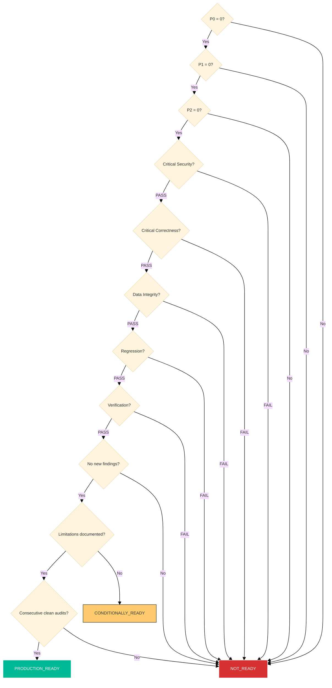

# AURA — Autonomous Engineering Audit Engine

An autonomous audit-remediate-verify loop that drives a repository toward a
defensible production-grade state, then keeps re-auditing until the
convergence gate is met or a genuine human blocker is hit.

```
Audit → Discover → Model → Adversarial Review → Correlate → Prioritize →
Remediate → Test → Verify → Regression → Update State → Convergence
```

---

## Current Status

| Field | Value |
|---|---|
| **Engine version** | v2.1.0 |
| **Cycles completed** | 10 |
| **Classification** | CONDITIONALLY READY |
| **Overall score** | 62 / 100 |
| **Open P0–P2** | 0 |
| **11th convergence gate** (`consecutive_clean_independent_audits`) | NOT YET MET |
| **Repository state** | NOT PRODUCTION READY |

### Convergence Gate Map

```
P0=0   P1=0  P2=0   crit-sec  crit-corr  data-int  regr  verify  no-new   lim-doc  consec-clean
 ✓      ✓     ✓       ✓         ✓          ✓         ✓      ✓       ✓        ✓         ✗
                                                                                        ↑
                                                                               gate NOT met yet
```

---

## What Aura Is

Aura is an **autonomous, evidence-oriented engineering audit engine** that
inspects your repository through repeated full-spectrum audit cycles. Every
cycle:

1. Reads the **entire repository** (not just diffs)
2. Performs both **independent and adversarial** reviews
3. Correlates, de-duplicates, and prioritizes findings
4. Drives remediation, testing, verification, and regression checks
5. Enforces a **strict state machine** on all finding transitions
6. Evaluates **11 convergence gates** before declaring production readiness

**Aura does not rely on tests passing alone, build passing alone, or LLM
self-claims.** Every claim must survive the full gate matrix.

---

## What Aura Is Not

- Aura does **not** replace human engineering judgment
- Aura does **not** guarantee zero undiscovered defects
- Aura does **not** claim security certification or compliance
- Aura does **not** automatically deploy code
- Aura's convergence is **evidence-backed**, not absolute

Aura is a **tool for driving systematic, reproducible audit discipline**.
It reduces the gap between "we think it's ready" and "we have evidence it's
ready," but it does not eliminate that gap.

---

## Quick Start

### Requirements

- PowerShell 5.1+ (Windows) or bash (macOS/Linux)
- Git (installed and on PATH)
- The target repository must be a git repository

### First Run

```powershell
# Clone the repository (if you haven't already)
git clone <repo-url>
cd <repo>

# Show current state
powershell -NoProfile -ExecutionPolicy Bypass -File .aura\run-audit.ps1 -Action status

# Generate a cycle prompt (feed it to the AI agent)
powershell -NoProfile -ExecutionPolicy Bypass -File .aura\run-audit.ps1 -Action run

# Validate state machine integrity
powershell -NoProfile -ExecutionPolicy Bypass -File .aura\run-audit.ps1 -Action validate-state
```

The `run` action writes the fully-injected cycle prompt to
`.aura\generated-cycle-prompt.md`. Feed that file to the AI agent as the
session prompt. The agent audits, remediates, and writes proposed state
files. The orchestrator validates and promotes them.

---

## Commands

### Core Cycle

| Command | Description |
|---|---|
| `status` | Show convergence status and open findings |
| `run` | Generate next cycle prompt (single-agent) |
| `run -MultiAgent` | Generate prompt for multi-agent mode |
| `context` | Generate context + prompt without advancing state |

### State Management

| Command | Description |
|---|---|
| `validate-state` | Validate state machine integrity (all transitions) |
| `promote-state` | Validate proposed state and commit to actual state |
| `reset` | Archive state and re-initialize engine |
| `run -Force` | Run even if converged or max cycles reached |

### Tooling & Verification

| Command | Description |
|---|---|
| `run-tooling` | Execute project test/lint/build commands, capture exit codes |
| `verify-findings` | Run independent verifier on all findings |
| `invariant-check` | Validate business invariants |
| `scope-check` | Analyze audit scope and file coverage |

### Attack Campaigns (Security Self-Test)

| Command | Description |
|---|---|
| `adversarial-campaign` | 12 attacks against state machine and evidence integrity |
| `false-convergence-campaign` | 9 attacks targeting convergence bypass |
| `false-evidence-campaign` | 10 attacks targeting evidence fabrication |
| `git-safety-campaign` | 10 scenarios testing git safety gates |
| `mutation-test` | Mutation testing of engine functions |
| `failure-recovery` | 7 failure-recovery scenarios |
| `security-scan` | Static security scan of target repository |

### Push

| Command | Description |
|---|---|
| `push` | Stage engine files, commit, push (interactive) |
| `push -Approve` | Auto-approve push (skip prompt) |

---

## Architecture

### Engine Layout

```text
.aura/
├── run-audit.ps1          Orchestrator (engine entry point)
├── config.json             Engine configuration
│
├── modules/                Pluggable engine modules
│   ├── adversarial-campaign.ps1
│   ├── business-invariants.ps1
│   ├── capability-scoring.ps1
│   ├── evidence-integrity.ps1
│   ├── failure-recovery.ps1
│   ├── false-convergence-extended.ps1
│   ├── false-evidence-attacks.ps1
│   ├── git-safety.ps1
│   ├── git-safety-adversarial.ps1
│   ├── independent-verifier.ps1
│   ├── mutation-testing.ps1
│   ├── repo-graph.ps1
│   ├── sandbox.ps1
│   ├── scale-benchmark.ps1
│   └── security-scan.ps1
│
├── agents/                 Multi-agent role definitions
│   ├── adversarial-auditor.md
│   ├── convergence-judge.md
│   ├── independent-auditor.md
│   ├── regression-auditor.md
│   ├── remediator.md
│   └── verifier.md
│
├── docs/                   Permanent documentation (prompted to agent)
│   ├── master.md
│   ├── cycle.md
│   └── adversarial.md
│
├── state/                  Engine state (authoritative)
│   ├── cycle.json
│   ├── findings.json
│   ├── convergence.json
│   ├── invariant-definitions.json
│   ├── baseline-snapshot.json
│   └── repo-graph.json
│
└── reports/                Persistent audit artifacts
    ├── architecture-map.md
    ├── audit-ledger.md
    ├── remediation-log.md
    ├── risk-register.md
    └── verification-matrix.md
```

*(Generated campaign results, runtime state, and evidence artifacts are
in `.gitignore` and not committed.)*

---

## Cycle Flow

```mermaid
%%{init: {'theme':'base', 'themeVariables': {'fontSize':'11px'}, 'flowchart':{'nodeSpacing':18,'rankSpacing':22}}}%%
flowchart LR
    A["DISCOVER"] --> B["MODEL"]
    B --> C["AUDIT"]
    C --> D["ADVERSARIAL_AUDIT"]
    D --> E["CORRELATE"]
    E --> F["PRIORITIZE"]
    F --> G["REMEDIATE"]
    G --> H["TEST"]
    H --> I["VERIFY"]
    I --> J["REGRESSION"]
    J --> K["UPDATE_STATE"]
    K --> L["CONVERGENCE"]
    L --> M["PUSH_APPROVAL"]
    M --> N{"Push?"}
    N -->|"Push Now"| O["git push"]
    N -->|"Push Later"| P["save to disk"]
    O --> Q{"Converged?"}
    P --> Q
    Q -->|"No"| A
    Q -->|"Yes"| R["DONE"]

    style M fill:#e94560,stroke:#fff,color:#fff
    style R fill:#00b894,stroke:#fff,color:#fff
```



## Convergence Gate

The engine stops **only** when ALL 11 gates pass across multiple
independent audit cycles:



### Gate Descriptions

| # | Gate | Condition |
|---|---|---|
| 1 | P0_zero | Zero open P0 (catastrophic) findings |
| 2 | P1_zero | Zero open P1 (critical) findings |
| 3 | P2_zero | Zero open P2 (high) findings |
| 4 | critical_security | All SECURITY category P0–P2 findings VERIFIED |
| 5 | critical_correctness | All CORRECTNESS category P0–P2 findings VERIFIED |
| 6 | data_integrity | All DATA_INTEGRITY findings VERIFIED |
| 7 | regression | Zero re-appeared findings from previous cycles |
| 8 | verification | All FIXED findings have independent verifier evidence |
| 9 | no_material_new_findings | Zero new P0–P3 findings for 2 consecutive cycles |
| 10 | limitations_documented | Remaining limitations explicitly listed |
| 11 | consecutive_clean_independent_audits | at least 2 cycles with zero new P0–P3 AND at least 3 independent cycles completed |

**Tests passed, build passed, or audit complete are NEVER sufficient
to declare convergence.**

---

## Evidence Model

Aura distinguishes between:

| Level | Meaning |
|---|---|
| **Discovered** | Finding identified by auditor |
| **Asserted** | Severity, category, and impact assessed |
| **Fixed** | Remediation applied |
| **Verified** | Independent verifier confirms fix with tool output evidence |
| **Regression-tested** | Regression audit confirms no re-introduced defects |
| **Converged** | All 11 gates independently passed |

A finding is **not** considered verified merely because a test passes,
an audit completes, or an agent claims verification. Every VERIFIED
finding requires:

1. Test/lint/build commands executed by the orchestrator (not the LLM)
2. Real exit codes captured in `tooling-evidence.json`
3. Independent verifier confirmation
4. Regression audit confirmation
5. State transition validated by the state machine

---

## State Machine Enforcement (v2.1.0)

The orchestrator enforces a strict state machine on all finding
transitions. Illegal transitions are **rejected**:

### Finding Transitions

| From | Allowed To |
|---|---|
| OPEN | IN_PROGRESS, DEFERRED, BLOCKED |
| IN_PROGRESS | FIXED, DEFERRED, BLOCKED, OPEN |
| FIXED | VERIFYING, OPEN |
| VERIFYING | VERIFIED, REJECTED, FIXED |
| VERIFIED | OPEN |
| REJECTED | OPEN, FIXED |

### Forbidden Direct Transitions

- OPEN → VERIFIED (must pass FIXED + VERIFYING)
- OPEN → FIXED (must pass IN_PROGRESS)
- IN_PROGRESS → VERIFIED (must pass FIXED + VERIFYING)
- FIXED → VERIFIED (must pass VERIFYING)

### Classification Transitions

```
NOT_READY → CONDITIONALLY_READY or HUMAN_BLOCKED
CONDITIONALLY_READY → PRODUCTION_READY, NOT_READY, or HUMAN_BLOCKED
PRODUCTION_READY → NOT_READY or HUMAN_BLOCKED
```

Direct `NOT_READY → PRODUCTION_READY` is **forbidden**.

### Additional Guards

- `overall_score` cannot decrease between cycles
- `overall_score` cannot increase by more than 15 per cycle
- `consecutive_converged_cycles` cannot jump by more than 1
- Any gate flip `false → true` requires documented evidence
- `converged = true` requires ALL 11 gates to pass

---

## Self-Test Capability

Aura includes a comprehensive self-test suite that validates its own
security guarantees. These can be run independently:

```powershell
powershell -NoProfile -ExecutionPolicy Bypass -File .aura\run-audit.ps1 -Action adversarial-campaign
powershell -NoProfile -ExecutionPolicy Bypass -File .aura\run-audit.ps1 -Action false-convergence-campaign
powershell -NoProfile -ExecutionPolicy Bypass -File .aura\run-audit.ps1 -Action false-evidence-campaign
powershell -NoProfile -ExecutionPolicy Bypass -File .aura\run-audit.ps1 -Action mutation-test
powershell -NoProfile -ExecutionPolicy Bypass -File .aura\run-audit.ps1 -Action failure-recovery
powershell -NoProfile -ExecutionPolicy Bypass -File .aura\run-audit.ps1 -Action git-safety-campaign
```

### Current Self-Test Results (Cycle 10)

| Campaign | Attacks | Detected | Breached | Errors | Rate |
|---|---|---|---|---|---|
| Adversarial | 12 | 12 | 0 | 0 | 100% |
| False Convergence | 9 | 9 | 0 | 0 | 100% |
| False Evidence | 10 | 10 | 0 | 0 | 100% |
| Failure Recovery | 7 | 7 | 0 | 0 | 100% |

---

## Reproducibility

Aura's state at any cycle is fully reproducible given:

1. The repository at a specific commit
2. The `.aura/state/` files at that cycle
3. The AI agent with the LLM session prompt from `.aura/generated-cycle-prompt.md`
4. The `.aura/config.json` configuration

The engine does **not** depend on:

- Interactive PowerShell state
- Environment variables (except PATH for git)
- Current working directory (uses `$PSScriptRoot` resolution)
- Prior-session function definitions
- Manual dot-sourcing

The orchestrator resolves its engine root deterministically and works
from any working directory, with any valid script invocation path.

---

## Limitations

### Known Architectural Limitations

1. **LLM dependence**: The actual audit, remediation, and verification
   logic runs in an LLM agent. The engine validates outputs but does not
   independently verify source code correctness.
2. **No formal verification**: The convergence gate uses empirical
   (repeated-audit) evidence, not formal proof.
3. **Context window constraint**: Repositories above 2000 tracked files
   require chunked/prioritized auditing. Full-context single-pass audit
   is impossible for large codebases.
4. **No runtime monitoring**: Aura audits source code and state, not
   live production behavior.
5. **Windows-first**: The orchestrator runs on PowerShell 5.1. A bash
   wrapper (`run-audit.sh`) exists but the engine core is PowerShell.

### What Aura Cannot Claim

- Zero undiscovered defects
- Formal security certification
- Guaranteed production safety
- Replacement for human code review
- Runtime behavior guarantees

---

## Multi-Agent Mode

Single-agent mode wears every hat in one pass. `-MultiAgent` fans the
work out into independent sub-agents for cross-verification:

1. **Independent Auditor** — full repository audit
2. **Adversarial Auditor** — attack the system from 6 adversarial roles
3. **Correlation** — merge, deduplicate findings
4. **Remediator** — fix prioritized findings
5. **Verifier** — independent verification of every fix
6. **Regression Auditor** — check for re-introduced defects
7. **Convergence Judge** — evaluate all 11 gates, return classification

Each agent produces independent evidence. The orchestrator validates
all state transitions and gate evidence before promotion.

```powershell
powershell -NoProfile -ExecutionPolicy Bypass -File .aura\run-audit.ps1 -Action run -MultiAgent
```

---

## Documentation Map

| Document | Scope |
|---|---|
| `README.md` | Project overview, quick start, architecture, convergence model |
| `.aura/docs/master.md` | Complete audit rules, standards, severity model, methodology |
| `.aura/docs/cycle.md` | Per-cycle phase execution blueprint |
| `.aura/docs/adversarial.md` | Adversarial audit methodology (6 roles) |
| `.aura/config.json` | Engine configuration (cycles, gates, severity weights, dimensions) |
| `.aura/reports/architecture-map.md` | Repository architecture model |
| `.aura/reports/audit-ledger.md` | Full finding history across all cycles |
| `.aura/reports/risk-register.md` | Active and historical risk register |
| `.aura/reports/verification-matrix.md` | Verification evidence matrix |
| `.aura/reports/remediation-log.md` | Remediation history |

---

## Version

AURA v2.1.0 — State Machine Enforcement