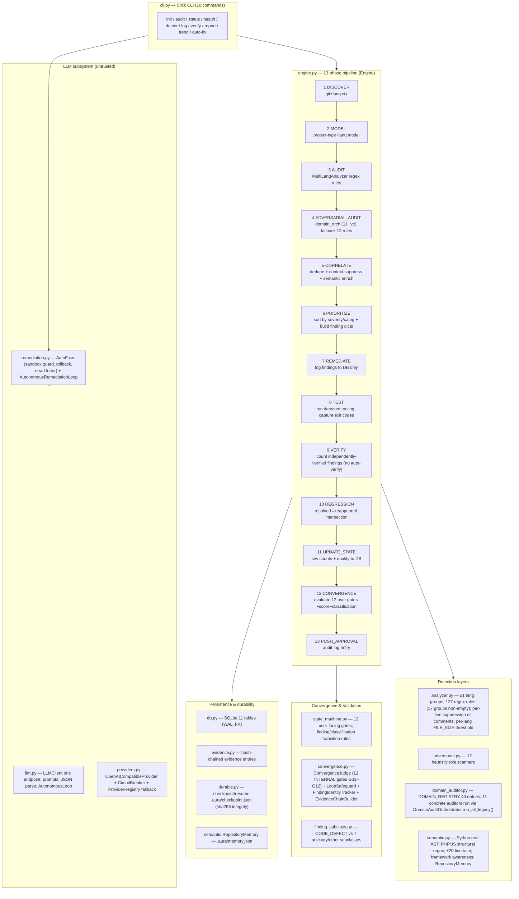

# AURA — System Architecture (blind-reconstructed)

> Rebuilt 2026-08-22 from source, tests, config, and live runtime probe only.
> Every claim cites the implementing location. Nothing was copied from prior docs.

## 1. What AURA is (evidence-based one-liner)

AURA is a **CLI-first, cyclic audit→remediate→verify engine for source repositories**.
Each cycle runs a fixed 13-phase pipeline (`Engine.PHASES`, `engine.py:53-57`),
detects issues from pattern matching, 12 adversarial heuristics, and 40-domain registry
(11 domains with concrete auditors), enriches findings with a semantic layer (Python AST,
PHP/JS structural regex, heuristic taint), persists everything to SQLite, and decides
convergence **deterministically** against a 12-gate user-facing gate model
(`state_machine.evaluate_all_gates`) — never from LLM output, which is treated as
untrusted candidate input (`llm.py:4`, `llm.py:22`).

- Package: `aura-audit` v3.5.3 (`pyproject.toml [project] version="3.5.3"`)
- Entry: `aura` / `python -m aura` → `aura.cli:main` (`pyproject [project.scripts]`)
- Distribution: `dist/aura_audit-3.5.3-py3-none-any.whl` + sdist (built with `uv build`)

## 2. Pipeline layer diagram



## 3. Subsystem dependency graph (module-level, computed from AST imports — DAG, **no cycles**)

```
analyzer         → (none — self-contained pattern tables)
adversarial      → evidence, state_machine        (self-test campaigns import gates)
domain_auditor   → adversarial                    (AdversarialFinding shape interop)
semantic         → (none)
execution_context→ (none)
finding_subclass → (none)
state_machine    → (none — pure functions)
convergence      → (none)
evidence         → (none)
errors           → (none)
logging          → (none)
config           → errors
db               → config
providers        → errors
llm              → (httpx only)
remediation      → convergence
engine           → finding_subclass, adversarial, domain_auditor, analyzer,
                   semantic, execution_context, config, db, evidence, llm,
                   logging, state_machine
durable          → (none — duck-typed on loop)
benchmark        → semantic
benchmark_v3     → (none)
cli              → config, durable, engine, errors, llm, logging, providers, remediation
__init__         → engine, analyzer, adversarial, domain_auditor, semantic,
                   state_machine, convergence, config, db, errors, llm, logging
__main__         → cli
```

Verification of acyclicity: DFS over AST-collected relative imports returned `CYCLES: NONE (DAG)` (probe 2026-08-22).

## 4. Key structural decisions (as implemented, not as intended)

| Decision | Implementation evidence |
|---|---|
| 13 phases, fixed order, sequential, single-threaded per cycle | `engine.py` `PHASES` + `run_audit` loop L152-183; per-phase `perf_counter` duration persisted to audit_log (IMP-09) |
| Detection = multi-source: regex analyzer + 12 heuristic roles + 11 live domain auditors, correlated | `_phase_audit(L217)`, `_phase_adversarial(L226)`, `_phase_correlate(L242-372)` with `_DOMAIN_TO_PRIMARY` canonical dedupe map |
| Findings deduped then execution-context-suppressed before persistence | `_phase_correlate` L417-435 (`context_suppressed` counted into lineage) |
| Semantic enrichment mitigates/downgrades gate inputs; failure → empty enrichment (no crash) | L446-464 `try/except Semantic analysis failed → semantic_enriched=[]` |
| Convergence = deterministic evaluation of 12 user gates + score; 2 consecutive clean audits required; `:limitations_documented` gate validates LIMITATIONS.md structurally | `_phase_convergence` (see decision-validation docs); `_validate_limitations_file` L580-676 |
| Two gate systems coexist: user-facing 12 gates + ConvergenceJudge G01–G12 | `state_machine.py:50-78` vs `convergence.py:123-136` (documented as correlated, not reconciled at runtime) |
| LLM is optional & untrusted: engine works LLM-free; remediation loop is the only LLM consumer | `Engine.__init__(llm_client=None)` L78-79 guard `if self.llm`; `llm.py:22` `untrusted=True` always |
| Provider resilience lives in exactly one layer (retry/circuit/fallback), no duplication | `providers.py:179-184` docstring; `llm.ProviderBackedLLMClient` "adds NO retry of its own" |
| Checkpoint/resume with SHA-256 state integrity, tamper-refusal | `durable.py:34-82` (`state_hash` verified on load; legacy flagged `_integrity=legacy-unverified`) |
| Evidence hash-chain with genesis `0*64` + reorder/deletion detection | `evidence.py:89-150` (`append` links `previous_hash`; `verify_chain` checks linkage) |

## 5. What the 13 phases each do (1-line + citation)

| # | Phase | Behavior | Source |
|---|---|---|---|
| 1 | DISCOVER | collect git context + per-language file counts → audit_log | `_phase_discover` L196-202 |
| 2 | MODEL | build project model (type, languages, file_count, branch) | L204-215 |
| 3 | AUDIT | run `MultiLangAnalyzer.analyze()`; record files/lines/issues/quality | L217-224 |
| 4 | ADVERSARIAL_AUDIT | `domain_orch.run_all_legacy()` (11 live domains + `_framework` + `_synthesis`); on exception fall back to `adversarial.run_all` 12 roles; filter `_` meta keys | L226-240 |
| 5 | CORRELATE | dedupe (canonical primary-key map + cross-source overlap) → context suppress → semantic enrich; writes full lineage to audit_log | L242-464 |
| 6 | PRIORITIZE | sort by severity-order→category; materialize `findings_list` via `_to_finding_dicts` (assigns stable `F-<sha256[:12]>` ids) | L466-474 |
| 7 | REMEDIATE | **logs only**: inserts findings (and ancillary GIT-ERROR/GIT-DIRTY/LANG-INFO) into DB; no automatic fix here | L476-501 |
| 8 | TEST | `_run_tooling(cn)` — auto-detect pytest/tsc/etc list; run; capture exit codes into `tooling_evidence` | L503-508 (+973-1026) |
| 9 | VERIFY | counts independently-verified findings (from remediation loop); explicitly does **not** auto-verify from global tooling pass | L510-530 |
| 10 | REGRESSION | resolved(VERIFIED/FIXED) IDs from prior cycles ∩ current IDs → `regressions` list | L532-553 (R2-02: any severity) |
| 11 | UPDATE_STATE | severity counts, code quality, tooling pass/total, regressions → audit_log | L555-578 |
| 12 | CONVERGENCE | evaluate 12 gates (with semantic mitigation + limitations check) → score → classification → gates persisted | L678+ & `_validate_limitations_file` L580-676 |
| 13 | PUSH_APPROVAL | final audit-log entry; `_complete_cycle` returns result dict | L135-183 |

## 6. Non-obvious runtime facts (measured, not assumed)

- `DomainAuditOrchestrator.run_all_legacy()` on an empty repo returned **13 keys**: 11 live
  domain auditors (`AUTHENTICATION, AUTHORIZATION, CONFIGURATION, CRYPTOGRAPHY, DEPENDENCY,
  DESERIALIZATION, INJECTION, INPUT_VALIDATION, PATH_AND_FILE, SECRET, SESSION`)
  **plus** 2 metadata keys `_framework` and `_synthesis` (filtered before corr."),
  probe 2026-08-22.
- `run_all()` ≠ `run_all_legacy()` (different result shape) — the engine uses `run_all_legacy()`.
- A tiny one-file Python repo reaches `CONDITIONALLY_READY` with score 95 and 10/12 gates pass,
  blocked by `limitations_documented` (no LIMITATIONS.md) and
  `consecutive_clean_independent_audits` (needs ≥2 clean cycles) — probe 2026-08-22.
- Analyzer tables: **51 language-group keys**, exactly **17** have rules, **127** total regex rules.
  The other 34 groups are extension-mapped but pattern-empty ("discovered only").
- Severity-weight tables intentionally differ per consumer:
  `analyzer.SEVERITY_WEIGHTS={P0:625,P1:125,P2:25,P3:5,P4:1,P5:0}` (quality score),
  `config` default `{P0:625,P1:405,P2:216,P3:90,P4:30,P5:6}` (convergence penalty mapping,
  normalized to historical penalties P0:15,P1:8,P2:3,P3-5:1 in `state_machine.compute_convergence_score`).

## 7. Hard boundaries AURA enforces (from code, not docs)

1. **Finding state machine**: 12 statuses, whitelisted transitions, forbidden direct jumps
   (`state_machine.VALID_FINDING_TRANSITIONS`, `FORBIDDEN_DIRECT_TRANSITIONS`).
2. **Classification state machine**: NOT_READY ↔ CONDITIONALLY_READY ↔ PRODUCTION_READY / HUMAN_BLOCKED
   (`VALID_CLASSIFICATION_TRANSITIONS`).
3. **Gate invariants**: convergence requires all 12 gates true; counter monotonicity
   (`validate_gate_evidence_integrity` rejects flips without evidence and counter rewind/jump).
4. **Gate↔finding cross-check**: a passing gate with open matching findings is flagged
   (`validate_gate_findings_crosscheck`).
5. **Sandbox guard in AutoFixer**: `is_relative_to` repo containment + dangerous-pattern
   advisory list + `old_code` match verification + full rollback (`remediation.py:95-238`).
6. **One-and-only-one retry layer**: providers only; callers must not retry on top
   (`providers.py:179-184`).

## 8. Architectural REJECTED/missing features (verified absent or stub)

- Cross-file call graph / inter-procedural taint: absent (LIMITATIONS.md §5; `semantic.py` operates per-file).
- Postgres: not implemented — SQLite only, designed for easy migration (`db.py:1-5`).
- PostgreSQL/async driver: optional `aiosqlite` extra exists in pyproject but no async code path uses it.
- 29 of 40 registry domains have **no concrete auditor** (registry-only metadata) — verified by
  mapping concrete `*Auditor(BaseDomainAuditor)` classes against registry keys (concrete list above).
- `registry.json` plugin system: empty (`plugins: []`, `plugin_count: 0`) — plugin mechanism is a stub.
- Notifications: `NotificationsConfig` exists but no producer emits notifications in the codebase.
