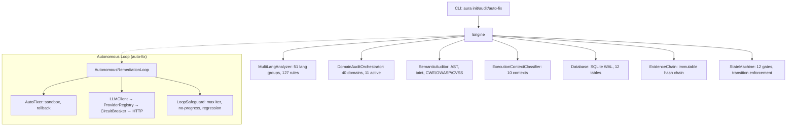

# Architecture — README

See [system-architecture.md](system-architecture.md) for the full architecture document.

## Quick Reference

| Component | File | Lines | Key Class(es) |
|---|---|---|---|
| Core Engine | `engine.py` | 1,130 | `Engine` |
| Multi-Lang Analyzer | `analyzer.py` | 518 | `MultiLangAnalyzer` |
| Adversarial Auditor (12 roles) | `adversarial.py` | 733 | `AdversarialAuditor` |
| Domain Auditor (40 domains) | `domain_auditor.py` | 1,016 | `DomainAuditOrchestrator` |
| Semantic Intelligence | `semantic.py` | 1,428 | `SemanticAuditor`, `TaintAnalyzer`, `ASTParser` |
| State Machine | `state_machine.py` | 452 | (functions) |
| Convergence Engine | `convergence.py` | 320 | `ConvergenceJudge`, `LoopSafeguard` |
| Finding Subclass | `finding_subclass.py` | 137 | `FindingSubclass`, `classify_finding()` |
| Execution Context | `execution_context.py` | 302 | `ExecutionContextClassifier` |
| Database | `db.py` | 616 | `Database` |
| LLM Client | `llm.py` | 219 | `LLMClient`, `AutonomousLoop` |
| Provider Layer | `providers.py` | 305 | `ProviderRegistry`, `CircuitBreaker`, `OpenAICompatibleProvider` |
| Evidence Chain | `evidence.py` | 210 | `Evidence`, `EvidenceChain`, `EvidenceValidator` |
| Remediation | `remediation.py` | 579 | `AutoFixer`, `AutonomousRemediationLoop` |
| Durable Execution | `durable.py` | 157 | `CheckpointManager`, `DurableAutonomousLoop` |
| Configuration | `config.py` | 233 | `AuraConfig` (Pydantic model) |
| Error Taxonomy | `errors.py` | 201 | `AuraError` + 9 subtypes |
| Logging | `logging.py` | 68 | `configure_logging()` |
| CLI | `cli.py` | 652 | 9 click commands |
| Benchmark | `benchmark.py`, `benchmark_v3.py` | — | `BenchmarkRunner` |

## Architecture Diagram

