# AURA v3.5 — System Architecture

> **Verified from:** `src/aura/engine.py`, `src/aura/analyzer.py`, `src/aura/semantic.py`, `src/aura/adversarial.py`, `src/aura/domain_auditor.py`, `src/aura/convergence.py`, `src/aura/state_machine.py`, `src/aura/providers.py`, `src/aura/db.py`, `src/aura/cli.py`

## Architectural Overview

AURA is a deterministic 13-phase autonomous software audit engine. It runs as a single Python process orchestrated from the CLI (`aura` command), operating on a local filesystem repository. The architecture follows a pipeline pattern: each audit cycle flows through 13 sequential phases, with no phase being skippable.

## Architectural Layers

```mermaid
graph TD
    subgraph "Presentation Layer"
        CLI["CLI (click) — cli.py"]
    end

    subgraph "Orchestration Layer"
        ENGINE["Engine — engine.py:50"]
        AUTOLOOP["AutonomousRemediationLoop — remediation.py:244"]
        DURABLE["DurableAutonomousLoop — durable.py:82"]
    end

    subgraph "Analysis Layer"
        ANALYZER["MultiLangAnalyzer — analyzer.py:437"]
        ADVERSARIAL["AdversarialAuditor — adversarial.py:42"]
        DOMAIN["DomainAuditOrchestrator — domain_auditor.py:924"]
        SEMANTIC["SemanticAuditor — semantic.py"]
        TAINT["TaintAnalyzer — semantic.py:755"]
        AST["ASTParser — semantic.py:333"]
    end

    subgraph "Decision Layer"
        STATE_MACHINE["state_machine.py"]
        CONVERGENCE["ConvergenceJudge — convergence.py:38"]
        SAFEGUARD["LoopSafeguard — convergence.py:163"]
        ID_TRACKER["FindingIdentityTracker — convergence.py:238"]
        SUBCLASS["FindingSubclass — finding_subclass.py"]
        CONTEXT["ExecutionContextClassifier — execution_context.py:158"]
    end

    subgraph "Persistence Layer"
        DB["Database — db.py:196"]
        CHECKPOINT["CheckpointManager — durable.py:22"]
        EVIDENCE_CHAIN["EvidenceChain — evidence.py:81"]
    end

    subgraph "External Integration Layer"
        LLM_CLIENT["LLMClient — llm.py:25"]
        PROVIDERS["ProviderRegistry/CircuitBreaker — providers.py"]
        SAST["SAST/Test tooling — subprocess calls"]
        GIT["git CLI — subprocess calls"]
    end

    CLI --> ENGINE
    ENGINE --> ANALYZER
    ENGINE --> ADVERSARIAL
    ENGINE --> DOMAIN
    ENGINE --> SEMANTIC
    ENGINE --> CONTEXT
    ENGINE --> DB
    ENGINE --> LLM_CLIENT
    AUTOLOOP --> ENGINE
    AUTOLOOP --> PROVIDERS
    AUTOLOOP --> SAFEGUARD
    AUTOLOOP --> CONVERGENCE
    DURABLE --> AUTOLOOP
    DURABLE --> CHECKPOINT
    CONVERGENCE --> STATE_MACHINE
    ENGINE --> STATE_MACHINE
```

## Major Subsystems

### 1. Core Engine (`engine.py`)
- **Class:** `Engine` — the central orchestrator
- **Phases:** 13 sequential phases (DISCOVER → PUSH_APPROVAL)
- **Owns:** database connection, analyzer, adversarial auditor, semantic auditor, evidence chain, domain orchestrator, execution context classifier
- **Entry point:** `run_audit()` which iterates phases 1-13 linearly
- **Size:** 1,130 lines

### 2. Multi-Language Analyzer (`analyzer.py`)
- **Class:** `MultiLangAnalyzer` — regex-based pattern scanning
- **Coverage:** 51 language groups (17 with active rules), 127 rules
- **Patterns:** `_PATTERNS` dictionary maps language keys → list of (regex, severity, category, rule, message) tuples
- **Extension mapping:** `LANG_EXTS` maps 50+ language keys → file extensions
- **Quality scoring:** `_compute_quality()` uses P0×15 + P1×8 + P2×3 per KLOC
- **Size:** 518 lines

### 3. Adversarial Auditor (`adversarial.py`) — 12 Roles
- **Class:** `AdversarialAuditor` — legacy 12-role auditor
- **Roles:** dependency, configuration, network, injection, secret, logic, architecture, performance, reliability, observability, testing, compliance
- **Integration:** Called by Engine._phase_adversarial(), fallback when domain orchestrator fails
- **Size:** 733 lines

### 4. Domain Audit Orchestrator (`domain_auditor.py`) — 40 Domains
- **Class:** `DomainAuditOrchestrator` — enhanced auditor with shared intelligence layer
- **Domains:** 40 domain metadata entries in `DOMAIN_REGISTRY`, 11 implemented in Wave 1
- **Shared Intelligence:** `SharedIntelligence` pre-indexes all files, parses dependency manifests, detects framework
- **5-Layer Audit:** Pattern (L1) → Structural/AST (L2) → Semantic/Taint (L3) → Cross-file (L4) → Evidence (L5)
- **Size:** 1,016 lines

### 5. Semantic Intelligence (`semantic.py`)
- **Classes:** `SemanticAuditor`, `TaintAnalyzer`, `ASTParser`, `RepositoryMemory`
- **Capabilities:** Python real-AST parsing (stdlib `ast`), PHP tokenizer-based parser, JS regex-based parser, taint tracking (source→sanitizer→sink), framework awareness (8 frameworks), CWE/OWASP/CVSS mapping
- **Data structures:** `FindingEvidence` with full evidence graph (source, sanitizers, sink, data_flow, CWE, CVSS)
- **Size:** 1,428 lines

### 6. State Machine & Convergence (`state_machine.py`, `convergence.py`)
- **State Machine:** Valid finding transitions (11 statuses), classification transitions (4 states), forbidden transitions, gate evidence integrity
- **Convergence:** 12 gates (P0_zero through module_dependency_integrity), scoring with finding penalties per severity, score invariants (max +15/cycle, no decrease)
- **Convergence Judge:** `ConvergenceJudge` — 12 internal gates (G01-G12) for autonomous loop; separate from 12 user-facing gates
- **Safeguards:** `LoopSafeguard` — max iterations, max same-finding attempts, no-progress detection, regression threshold

### 7. Provider/LLM Layer (`providers.py`, `llm.py`)
- **LLMClient:** Simple OpenAI-compatible HTTP client (httpx-based)
- **ProviderRegistry:** Multi-provider registry with priority-based fallback routing
- **CircuitBreaker:** Stateful circuit breaker (CLOSED→OPEN→HALF_OPEN) with rolling window, cooldown, failure threshold
- **OpenAICompatibleProvider:** Provider implementation with retry and exponential backoff

### 8. Persistence (`db.py`, `durable.py`, `evidence.py`)
- **Database:** SQLite (WAL mode, foreign keys) with 12 tables
- **CheckpointManager:** JSON-based cycle checkpointing for resume support
- **EvidenceChain:** Immutable hash chain for evidence integrity

## Runtime Boundaries

| Boundary | Description |
|---|---|
| **Process** | Single Python process, no forking or threading (synchronous) |
| **Filesystem** | Reads from repo_root, writes to `.aura/` directory |
| **Network** | HTTP calls to LLM API (OpenAI-compatible), optional Ollama detection |
| **Subprocess** | `git` commands, SAST tools (semgrep, bandit, gitleaks), language tooling (tsc, pytest, npm, go test, cargo test) |
| **Database** | SQLite file at `.aura/state/aura.db` |
| **Memory** | In-process only — no shared memory, no IPC |

## Key Dependencies

| Dependency | Version | Purpose |
|---|---|---|
| click | >=8.0 | CLI framework |
| rich | >=13.0 | Terminal formatting |
| pydantic | >=2.0 | Configuration validation |
| httpx | >=0.27 | LLM API HTTP client |
| tenacity | >=9.0 | Retry library (declared, used indirectly via providers) |
| structlog | >=24.0 | Structured logging to stderr |
| python-dotenv | >=1.0 | .env file loading |

## Architectural Properties

- **Synchronous:** All execution is synchronous (no async/await, no threading)
- **Sequential:** 13 phases execute in fixed order, no parallelism
- **Deterministic gates:** Convergence decisions use measurable invariants, not LLM claims
- **LLM = UNTRUSTED:** All LLM output is marked `untrusted=True` by default
- **Evidence-first:** VERIFIED findings require independent tool exit codes
- **Single database:** One SQLite file per audited project
- **No plugin system:** registry.json shows 0 plugins — the file is a placeholder