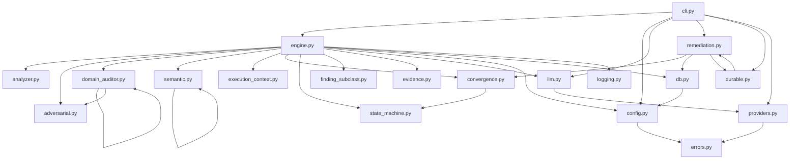

# Component Diagram — AURA v3.5

> **Verified from:** all `src/aura/*.py` files

## Package Structure

```
src/aura/
├── __init__.py          # Public API exports
├── __main__.py          # python -m aura entry point
├── cli.py               # CLI (click), 9 commands
├── config.py            # Configuration (Pydantic models)
├── engine.py            # Core engine — 13-phase pipeline
├── analyzer.py          # Multi-language regex scanner (51 lang groups, 127 rules)
├── adversarial.py       # 12-role adversarial auditor (legacy)
├── domain_auditor.py    # 40-domain auditor with shared intelligence
├── semantic.py          # AST parser, taint analyzer, CWE/OWASP/CVSS, memory
├── convergence.py       # Convergence judge, safeguards, identity tracking
├── state_machine.py     # Finding/classification transitions, gates
├── finding_subclass.py  # Finding subtype classification (CODE_DEFECT, etc.)
├── execution_context.py # File context classifier (10 execution contexts)
├── evidence.py          # Evidence model, hash chain, validator
├── providers.py         # LLM provider registry + circuit breaker
├── llm.py               # LLM client + autonomous loop prompts
├── remediation.py       # AutoFixer + AutonomousRemediationLoop
├── durable.py           # Checkpoint/resume manager
├── db.py                # SQLite database layer (12 tables)
├── errors.py            # Error taxonomy (14 categories, 9 types)
├── logging.py           # Structured logging (structlog)
├── benchmark.py         # Benchmark runner (v2)
└── benchmark_v3.py      # Benchmark runner (v3)
```

## Component Dependencies



## Coupling Analysis

### Tight Coupling
- **Engine → DB:** Direct dependency, Engine owns a Database instance
- **Engine → Analyzer:** Direct dependency through `self.analyzer`
- **Engine → DomainAuditOrchestrator:** Direct dependency through `self.domain_orch`
- **CLI → Engine:** Direct instantiation in each command handler
- **AutonomousRemediationLoop → Engine:** Takes Engine as parameter, calls `engine.run_audit()`
- **DomainAuditOrchestrator → AdversarialAuditor:** Imports `AdversarialFinding` for legacy interface conversion

### Loose Coupling (Through Function Calls)
- **state_machine:** Pure functions, no class instantiation — called by Engine and ConvergenceJudge
- **finding_subclass:** Pure functions, called by Engine
- **execution_context:** Classifier with cache, called by Engine
- **errors:** Exception classes, used across the codebase

### Circular Dependencies
- **NONE detected** — all imports are directional (cli → engine → modules, no reverse imports)

### Abstraction Boundaries
| Boundary | Interface | Implementation |
|---|---|---|
| LLM access | `LLMClient.chat()` / `BaseProvider.chat()` | `LLMClient` (simple), `OpenAICompatibleProvider` (with retry/circuit) |
| Provider routing | `ProviderRegistry.chat_with_fallback()` | Priority-ordered list with health checks |
| Database access | `Database` class | SQLite with WAL, transactions, repository pattern methods |
| Configuration | `AuraConfig` Pydantic model | Validated at startup, fail-fast on invalid |
| State machine | Pure functions in `state_machine.py` | Dictionaries, no mutable state |
| Evidence | `EvidenceChain`, `EvidenceValidator` | Hash chain + independent validation rules |

### Responsibility Leakage
| Location | Concern | Should be in |
|---|---|---|
| `engine.py:888-905` | Project type detection | `analyzer.py` or separate module |
| `engine.py:935-954` | Command auto-detection | Separate `tooling.py` module |
| `engine.py:538-633` | LIMITATIONS.md validation | Separate `gate_validators.py` module |
| `engine.py:226-269` | Cross-rule normalization maps | `domain_auditor.py` (already consumed by correlator) |
| `cli.py:46-86` | Gate descriptions, remediation guides | `state_machine.py` or `remediation.py` |

## Module Summary

| Module | Lines | Purpose | Exports |
|---|---|---|---|
| `engine.py` | 1,130 | 13-phase audit engine | `Engine`, `AncillaryFinding`, `CodeIssueBridge` |
| `semantic.py` | 1,428 | AST, taint, CWE/OWASP/CVSS, memory | `SemanticAuditor`, `TaintAnalyzer`, `ASTParser`, `FindingEvidence`, `ConfidenceLevel` |
| `domain_auditor.py` | 1,016 | 40-domain audit, shared intelligence | `DomainAuditOrchestrator`, `SharedIntelligence`, `DOMAIN_REGISTRY` |
| `adversarial.py` | 733 | 12-role auditor (legacy) | `AdversarialAuditor`, `AdversarialFinding`, `SelfTestCampaigns` |
| `cli.py` | 652 | CLI interface | 9 click commands (`init`, `audit`, `status`, `health`, `doctor`, `verify`, `log`, `report`, `trend`, `auto-fix`) |
| `db.py` | 616 | SQLite database layer | `Database` |
| `remediation.py` | 579 | Auto-fix + autonomous loop | `AutoFixer`, `AutonomousRemediationLoop`, `FixResult`, `RemediationPlan` |
| `analyzer.py` | 518 | Multi-language regex scanner | `MultiLangAnalyzer`, `CodeAudit`, `CodeIssue`, `TrendAnalyzer` |
| `state_machine.py` | 452 | State transitions, gates, scoring | 8 functions (all pure) |
| `convergence.py` | 320 | Convergence judge, safeguards | `ConvergenceJudge`, `LoopSafeguard`, `FindingIdentityTracker`, `EvidenceChainBuilder` |
| `providers.py` | 305 | Provider abstraction layer | `ProviderRegistry`, `CircuitBreaker`, `OpenAICompatibleProvider`, `BaseProvider` |
| `execution_context.py` | 302 | File context classifier | `ExecutionContextClassifier`, `ExecutionContext`, `FileContext` |
| `config.py` | 233 | Pydantic configuration models | `AuraConfig` with nested `EngineConfig`, `DatabaseConfig`, etc. |
| `llm.py` | 219 | LLM client + prompts | `LLMClient`, `AutonomousLoop`, `LLMResponse` |
| `evidence.py` | 210 | Evidence model + validation | `Evidence`, `EvidenceChain`, `EvidenceValidator`, `EvidenceLevel` |
| `errors.py` | 201 | Error taxonomy | `AuraError` + 9 typed subtypes |
| `durable.py` | 157 | Checkpoint/resume | `CheckpointManager`, `DurableAutonomousLoop` |
| `finding_subclass.py` | 137 | Finding subtype classification | `FindingSubclass`, `classify_finding()`, `is_blocking_for_gate()` |
| `logging.py` | 68 | Structured logging | `configure_logging()`, `log` instance |
| `__init__.py` | 24 | Public API | Re-exports 20+ public symbols |