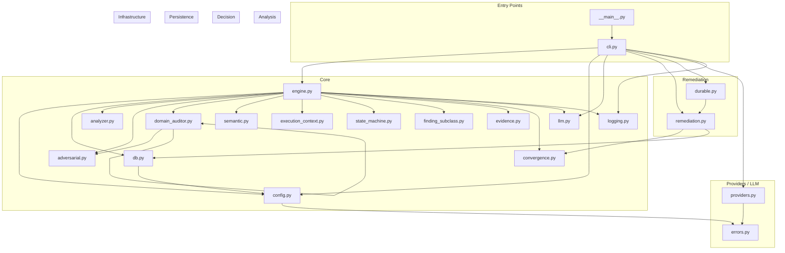

# Component Dependency Graph — AURA v3.5

> **Verified from:** import analysis of all `src/aura/*.py` files

## Import Graph

## Dependency Counts (fan-in / fan-out)

| Module | Imported by (fan-in) | Imports (fan-out) |
|---|---|---|
| `config.py` | cli, engine, db | errors |
| `errors.py` | config, providers | (stdlib only) |
| `db.py` | cli, engine, remediation | config |
| `engine.py` | cli, remediation | config, db, analyzer, adversarial, domain_auditor, semantic, execution_context, state_machine, finding_subclass, evidence, convergence, llm, logging |
| `analyzer.py` | engine | (stdlib only — stdlib `re`, `dataclasses`, `pathlib`) |
| `adversarial.py` | engine, domain_auditor | (stdlib only) |
| `domain_auditor.py` | engine | adversarial |
| `semantic.py` | engine | (stdlib only — `ast`, `re`, `json`) |
| `execution_context.py` | engine | (stdlib only) |
| `state_machine.py` | engine, convergence | (stdlib only) |
| `finding_subclass.py` | engine | (stdlib only) |
| `evidence.py` | engine | (stdlib only) |
| `convergence.py` | engine, remediation | (stdlib only) |
| `llm.py` | cli, engine | (httpx only) |
| `providers.py` | cli | errors |
| `remediation.py` | cli | convergence, db |
| `durable.py` | cli | (stdlib only) |
| `logging.py` | cli, engine | structlog |
| `cli.py` | __main__ | config, engine, llm, remediation, durable, providers, logging |

## Key Observations

1. **`engine.py` is the highest fan-out module** — imports from 13 other aura modules. This is expected for an orchestrator but creates a broad dependency surface.

2. **Most analysis modules are self-contained** — `analyzer.py`, `semantic.py`, `state_machine.py`, `finding_subclass.py`, `evidence.py`, `execution_context.py`, `adversarial.py` import only stdlib.

3. **No circular imports** — The dependency graph is strictly acyclic (DAG).

4. **`providers.py` is underutilized** — Only imported by `cli.py` for the `auto-fix` command. `engine.py` uses the simpler `LLMClient` directly, not the `ProviderRegistry` with circuit breaker.

5. **`benchmark.py` and `benchmark_v3.py` have zero in-project imports** — standalone test utilities not imported by any production module.