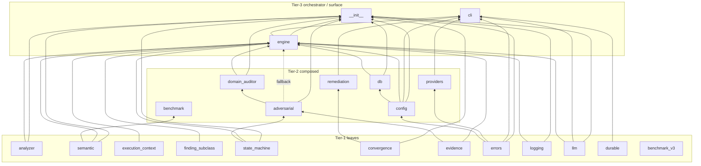

# Module Dependency Graph

> Computed from AST relative-import analysis of all 23 `src/aura/*.py` (2026-08-22).
> No import cycles — structure is a DAG and tiers are stable.

## Graph edges (module → imported sibling modules)

```
__init__       → adversarial, analyzer, config, convergence, db,
                 domain_auditor, engine, errors, llm, logging,
                 semantic, state_machine
__main__       → cli
adversarial    → evidence, state_machine
analyzer       → (leaf)
benchmark      → semantic
benchmark_v3   → (leaf)
cli            → config, durable, engine, errors, llm, logging, providers, remediation
config         → errors
convergence    → (leaf)
db             → config
domain_auditor → adversarial
durable        → (leaf)
engine         → adversarial, analyzer, config, db, domain_auditor,
                 evidence, execution_context, finding_subclass, llm,
                 logging, semantic, state_machine
errors         → (leaf)
evidence       → (leaf)
execution_context → (leaf)
finding_subclass  → (leaf)
llm            → (leaf)
logging        → (leaf)
providers      → errors
remediation    → convergence
semantic       → (leaf)
state_machine  → (leaf)
```

## Visualized



## Coupling hotspots (verified)

- **engine.py** imports 12 sibling modules — highest fan-in/fan-out by design (orchestrator).
- **__init__.py** re-exports 12 modules — keeps public API stable but means importing any
  submodule boots the same transitive set (engine → db → config → errors; engine →
  domain_auditor → adversarial → evidence+state_machine).
- **cli.py** imports 8 sibling modules — thin surface but will load engine, remediation,
  and the provider stack at startup even for commands like `aura doctor`.

## Risk profile
- No circular imports at module level.
- `llm.py` imports `httpx` **unconditionally** at module top — even when the engine
  runs LLM-free, `import aura` still pulls `httpx` (it is a declared runtime dependency).
  Optional-LLM use relies on `llm_client=None`, not on module absence.
