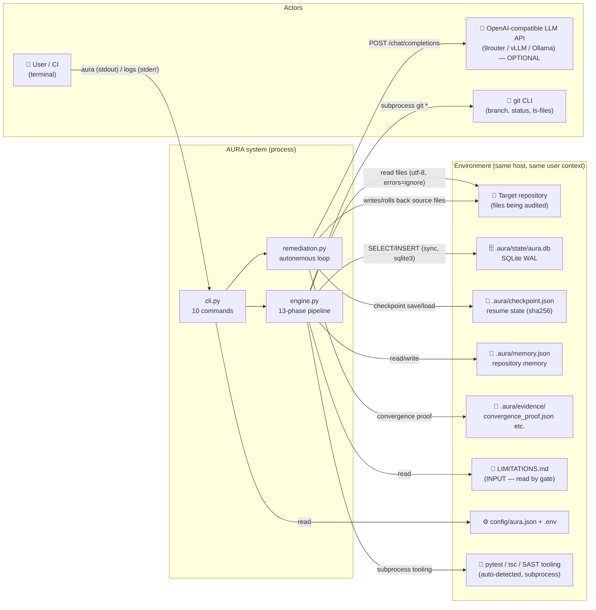

# Context Diagram — AURA (system boundary)

> Verified against `cli.py:89-632`, `engine.py:50-183`, `db.py:196-650`,
> `durable.py:22-215`, `llm.py:25-77`, `providers.py:176-372`, `remediation.py:58-588`.

## Boundary

## External interactions (exact)

| Counterparty | Direction | Mechanism | Evidence |
|---|---|---|---|
| Target repo filesystem | AURA → read (always) / write (only `auto-fix`) | `pathlib` read_text utf-8 errors=ignore; write_text utf-8 | `engine.py:478`; `remediation.py:151,199` |
| SQLite file | bidirectional | `sqlite3` stdlib, WAL, FK, isolation_level=None | `db.py:213-217` |
| git CLI | AURA → git | `subprocess.run(["git", ...])` in `_get_git_context` | `engine.py:888-913` |
| pytest/tsc/SAST tooling | AURA → subprocess | `_run_tooling` auto-detection + exit-code capture | `engine.py:973-1026` |
| LLM HTTP API | AURA → LLM | `httpx.post("{base}/chat/completions")` Bearer key | `llm.py:59-77`; `providers.py:238-243` |
| LIMITATIONS.md | AURA → read (INPUT, gate feeds off it) | `_validate_limitations_file()` every CONVERGENCE phase | `engine.py:594-676` |
| config/aura.json + .env | AURA → read at startup | pydantic-validated; `load_dotenv()` at cli import | `config.py:175-232`; `cli.py:39` |
| .aura/checkpoint.json | bidirectional | written at cycle boundary; sha256 state integrity | `durable.py:34-82` |
| .aura/memory.json | bidirectional | RepositoryMemory JSON persistence | `semantic.py` RepositoryMemory |
| .aura/evidence/ | AURA → write | convergence proof + per-cycle audit/verification JSON | `convergence.py:274-324` |
| stdout / stderr | AURA → user | stdout reserved for results; ALL logs to stderr | `logging.py:1-58` |

## Not in the boundary (verified absent)

- No network listener/server of any kind — AURA is process-in, process-out CLI.
- No IPC beyond subprocesses; no sockets besides outbound HTTPS to the LLM endpoint.
- No read of cloud state, no telemetry, no phone-home (no such imports anywhere in `src/aura/*`).
- `registry.json` plugin system is present as a file but has `plugin_count: 0` — plugin boundary
  exists on disk but is inert.
