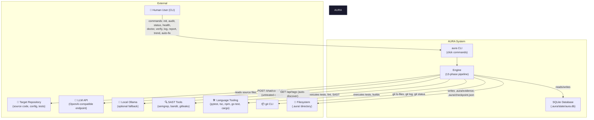

# Context Diagram — AURA v3.5

> **Verified from:** `src/aura/cli.py`, `src/aura/engine.py`, `src/aura/llm.py`, `src/aura/providers.py`, `src/aura/db.py`

## External Actors and Systems

## Data Exchange Directions

| From | To | Data | Direction |
|---|---|---|---|
| User | AURA CLI | CLI args: `--repo`, `--config`, `--verbose`, `--json` | → Inbound |
| AURA CLI | User | stdout: audit results (JSON or rich formatted), reports | ← Outbound |
| AURA CLI | User | stderr: structured logs (structlog) | ← Outbound |
| Engine | Repository | Reads source files, config manifests, .env | → Read |
| Engine | git CLI | `git ls-files`, `git log --oneline -5`, `git status --short`, `git branch` | → Subprocess stdout |
| Engine | SAST/Lang Tools | `subprocess.run([cmd])` — exit codes + stdout/stderr captured | ← Subprocess result |
| Engine | SQLite DB | INSERT/UPDATE/SELECT on 12 tables | ↔ Read/Write |
| Engine | Filesystem | Writes `.aura/state/aura.db`, `.aura/checkpoint.json`, `.aura/evidence/cycle-NNN/` | → Write |
| LLMClient | LLM API | POST with JSON body (system prompt + user message) | → Request |
| LLM API | LLMClient | JSON response with `choices[0].message.content` | ← Response (UNTRUSTED) |
| ProviderRegistry | Ollama | GET /api/tags (auto-discover local models) | → Request |
| AutoFixer | Filesystem | Writes modified source files, `.patch` files | → Write (with rollback) |

## Key Principles

1. **All LLM output is UNTRUSTED** — marked `untrusted=True` at the protocol level (`llm.py:22`, `providers.py:40`)
2. **Tool output is OBSERVABLE EVIDENCE** — exit codes, stdout, stderr captured and stored
3. **No external auth needed** for core operation — only LLM API key for auto-fix
4. **Repository access is local-only** — all source scanning happens via filesystem reads, not API calls
5. **Database is embedded** — SQLite in-process, no external DB server