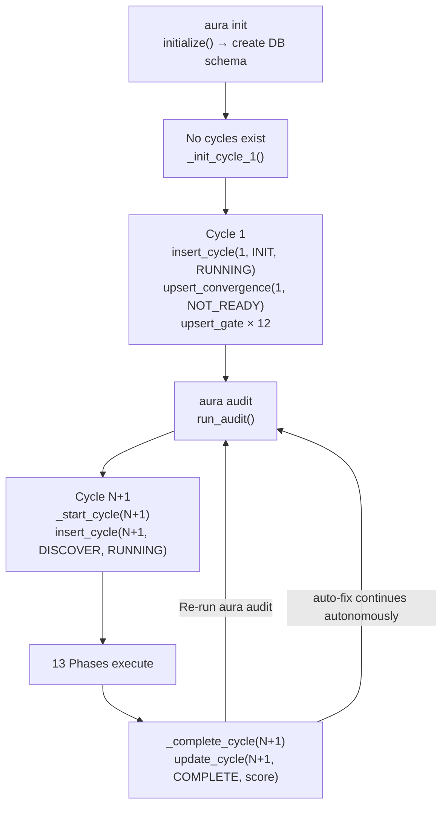

# Data Lifecycle — AURA v3.5

> **Verified from:** `src/aura/db.py`, `src/aura/engine.py`, `src/aura/remediation.py`

## Cycle Lifecycle



## Finding Lifecycle

```mermaid
graph LR
    A["P3: AUDIT\nMultiLangAnalyzer → regex matches"] --> B["P5: CORRELATE\ndedup, normalize, context filter\n→ unique findings list"]
    B --> C["P7: REMEDIATE\n_to_finding_dicts() → DB insert_finding()"]
    C --> D["DB: findings table\nstatus = OPEN"]
    D --> E["Autonomous Loop:\nLLM generates fix\nAutoFixer.apply_fix()"]
    E --> F["DB: update_finding_status(FIXED)"]
    F --> G["DB: update_finding_status(VERIFYING)"]
    G --> H["Autonomous Loop:\nTooling verification\nEvidence gathering"]
    H --> I["DB: update_finding_status(VERIFIED)"]
    I --> J["P10: REGRESSION\ncheck reappeared findings\ncross-cycle stable ID match"]
```



## Database Write Patterns

### INSERT (new rows)
- `insert_cycle()` — once per cycle start
- `insert_finding()` — once per finding per cycle (UPSERT on finding_id)
- `insert_tooling_evidence()` — once per tool command per cycle
- `insert_audit_log()` — at least once per phase
- `insert_remediation_attempt()` — per fix attempt
- `insert_dead_letter()` — per failed/unparseable LLM response

### UPSERT (insert or update)
- `upsert_convergence()` — once per cycle (UPDATE if exists)
- `upsert_gate()` — once per gate per cycle (INSERT OR REPLACE)
- `upsert_convergence_confidence()` — once per cycle (INSERT OR REPLACE)
- `insert_finding()` — has ON CONFLICT DO UPDATE for existing finding_ids

### UPDATE (modify existing)
- `update_cycle()` — phase updates throughout cycle, final status update
- `update_finding_status()` — status transitions during autonomous loop

### FINDING STATUS PRESERVATION

When a finding is re-inserted (same `finding_id`, new cycle), the ON CONFLICT clause preserves terminal statuses:

```sql
ON CONFLICT(finding_id) DO UPDATE SET
    status = CASE WHEN findings.status IN ('VERIFIED','WAIVED','ACCEPTED_RISK','OUT_OF_SCOPE')
                  THEN findings.status ELSE excluded.status END,
```

This means: if a finding was already VERIFIED/WAIVED/ACCEPTED_RISK/OUT_OF_SCOPE in a previous cycle, re-auditing does NOT reset it to OPEN.

## Persistence Boundaries

| Data | Storage | Retention |
|---|---|---|
| Cycle state | `cycles` table | Forever (never truncated) |
| Findings | `findings` table | Forever (stable IDs, cross-cycle tracking) |
| Convergence | `convergence` table | Forever |
| Gates | `gates` table | Forever (one row per cycle per gate) |
| Tooling evidence | `tooling_evidence` table | Forever |
| Audit log | `audit_log` table | Forever (immutable) |
| Evidence chain | `evidence_chain` table + JSON files | Forever |
| Remediation attempts | `remediation_attempts` table | Forever |
| Dead letters | `dead_letter` table | Forever (until purged) |
| Confidence metrics | `convergence_confidence` table | Forever |
| Checkpoint | `.aura/checkpoint.json` | Until cleared or overwritten |
| Cycle evidence | `.aura/evidence/cycle-NNN/` | Forever (filesystem) |
| In-memory state | Python objects | Duration of CLI invocation |