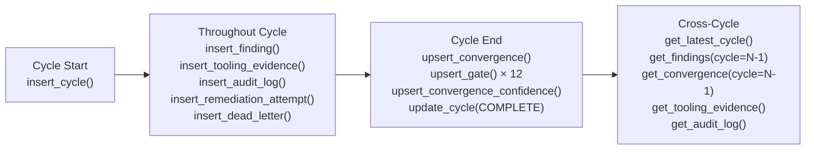

# Data Model — AURA v3.5

> **Verified from:** `src/aura/db.py:23-193`

## ERD (Entity-Relationship Diagram)

```mermaid
erDiagram
    cycles ||--o{ findings : "has"
    cycles ||--o{ convergence : "has"
    cycles ||--o{ gates : "has"
    cycles ||--o{ tooling_evidence : "has"
    cycles ||--o{ audit_log : "logs"
    cycles ||--o{ remediation_attempts : "has"
    cycles ||--o{ dead_letter : "has"
    cycles ||--o{ convergence_confidence : "has"
    cycles ||--o{ evidence_chain : "references"

    cycles {
        int id PK
        int cycle_number UK
        text phase
        text status
        text classification
        int overall_score
        int cycles_without_progress
        int consecutive_converged_cycles
        text started_at
        text completed_at
        text last_change_hash
        text created_at
        text updated_at
    }

    findings {
        int id PK
        text finding_id UK
        int cycle_number FK
        text severity "P0-P5"
        text category
        text status "11 statuses"
        text problem
        text file_path
        int line_number
        text remediation
        text evidence
        text assigned_to
        text reviewed_by
        text created_at
        text updated_at
    }

    convergence {
        int id PK
        int cycle_number UK FK
        int converged
        text classification
        text reason
        int overall_score
        int consecutive_converged_cycles
        int audits_since_last_finding
        text created_at
    }

    gates {
        int id PK
        int cycle_number FK
        text gate_name
        int passed
        text evidence
        text created_at
    }

    tooling_evidence {
        int id PK
        int cycle_number FK
        text command
        int exit_code
        int success
        text output
        text executed_at
    }

    audit_log {
        int id PK
        text event_type
        int cycle_number
        text finding_id
        text actor
        text detail
        text metadata
        text created_at
    }

    evidence_chain {
        int id PK
        text evidence_id UK
        text content_hash
        text signature
        text signer
        text public_key_fingerprint
        int chain_index
        text previous_hash
        text payload
        text created_at
    }

    remediation_attempts {
        int id PK
        text attempt_id UK
        int cycle_number FK
        text finding_id
        text file_path
        int line_start
        int line_end
        text status "PENDING-ROLLED_BACK"
        text patch_content
        text error_message
        int duration_ms
        text created_at
    }

    dead_letter {
        int id PK
        text finding_id
        int cycle_number FK
        int attempt_number
        text error_type "UNPARSEABLE-UNKNOWN"
        text raw_response
        text recovery_hint
        text status "PENDING-ABANDONED"
        text created_at
    }

    convergence_confidence {
        int id PK
        int cycle_number UK FK
        int verification_confidence
        int detection_confidence
        int test_confidence
        real tooling_pass_ratio
        real file_coverage_ratio
        real verified_findings_ratio
        text created_at
    }
```

## Database Configuration

- **Engine:** SQLite
- **Location:** `.aura/state/aura.db` (configurable via `database.path`)
- **Journal mode:** WAL (Write-Ahead Logging)
- **Foreign keys:** ON
- **Busy timeout:** 5000ms
- **Schema version:** 1 (tracked in `_schema_version` table)

**Source:** `src/aura/db.py:210-218`, `src/aura/config.py:127-132`

## Indexes

| Index | Table | Column(s) | Purpose |
|---|---|---|---|
| `idx_findings_cycle` | findings | cycle_number | Filter findings by cycle |
| `idx_findings_status` | findings | status | Filter by status |
| `idx_findings_severity` | findings | severity | Filter by severity |
| `idx_gates_cycle` | gates | cycle_number | Filter gates by cycle |
| `idx_gates_name` | gates | gate_name | Filter gates by name |
| `idx_evidence_chain_index` | evidence_chain | chain_index | Sequential scan of evidence chain |
| `idx_audit_log_cycle` | audit_log | cycle_number | Filter audit log by cycle |
| `idx_audit_log_event` | audit_log | event_type | Filter by event type |
| `idx_remediation_cycle` | remediation_attempts | cycle_number | Filter remediation attempts by cycle |

## Data Lifecycle



## Finding Status enum (11 active + 3 terminal)

| Status | Type | Allowed transitions |
|---|---|---|
| OPEN | Active | IN_PROGRESS, DEFERRED, BLOCKED |
| IN_PROGRESS | Active | FIXED, DEFERRED, BLOCKED, OPEN |
| FIXED | Active | VERIFYING, OPEN |
| VERIFYING | Active | VERIFIED, REJECTED, FIXED |
| VERIFIED | Active | OPEN |
| REJECTED | Active | OPEN, FIXED |
| DEFERRED | Active | OPEN |
| BLOCKED | Active | OPEN |
| UNVERIFIED | Active | OPEN |
| WAIVED | Terminal | (none) |
| ACCEPTED_RISK | Terminal | (none) |
| OUT_OF_SCOPE | Terminal | (none) |

## Error types for dead_letter

| error_type | Description |
|---|---|
| UNPARSEABLE | LLM returned non-JSON response |
| TIMEOUT | LLM request timed out |
| PROVIDER_ERROR | Provider returned error |
| INVALID_FIX | Fix did not match source code |
| SANDBOX_REJECTED | Fix contained dangerous patterns |
| UNKNOWN | Uncategorized failure |