# Audit Decision Flow — AURA v3.5

> **Verified from:** `src/aura/engine.py:636-749`, `src/aura/state_machine.py:360-452`, `src/aura/finding_subclass.py`

## Gate Evaluation Decision Tree

```mermaid
graph TD
    START["findings list + cycle state"] --> SEM{"Semantically\nmitigated?"}
    SEM -->|MITIGATED/FALSE_POSITIVE| FILTER["Remove from active set"]
    SEM -->|All others| ACTIVE["Active findings"]
    FILTER --> ACTIVE
    
    ACTIVE --> EVAL["evaluate_all_gates()"]
    
    EVAL --> P0{"P0_zero?\nAny OPEN/IN_PROGRESS P0?"}
    P0 -->|Yes: false| P0_FAIL["P0_zero = FALSE"]
    P0 -->|No: true| P1{"P1_zero?\nAny OPEN/IN_PROGRESS P1?"}
    P1 -->|Yes: false| P1_FAIL["P1_zero = FALSE"]
    P1 -->|No: true| P2{"P2_zero?\nAny OPEN/IN_PROGRESS P2?"}
    
    P2 --> SUBCLASS{"Subclass-aware\noverride"}
    SUBCLASS -->|Only CODE_DEFECT\nblocks P2_zero| P2_FINAL["P2_zero determined"]
    
    P2_FINAL --> SEC{"critical_security?\nAll P0-P2 SECURITY VERIFIED?"}
    SEC -->|Only CODE_DEFECT\nSECURITY blocks| SEC_FINAL["critical_security determined"]
    
    SEC_FINAL --> CORR{"critical_correctness?\nAll P0-P2 CORRECTNESS VERIFIED?"}
    CORR --> DI{"data_integrity?\nAll P0-P2 DATA_INTEGRITY VERIFIED?"}
    DI --> REGR{"regression?\nZero re-appeared?"}
    REGR --> VERIF{"verification?\nAny FIXED (unverified)?"}
    VERIF --> NEW{"no_material_new_findings?\nNew P0-P3?"}
    NEW --> LIM{"limitations_documented?\nFile valid?"}
    LIM --> CONSEC{"consecutive_clean?\n≥2 conv + ≥2 since finding?"}
    CONSEC --> MOD{"module_dependency_integrity?\nAlways true"}
    
    P0_FAIL --> SCORE["compute_convergence_score()"]
    P1_FAIL --> SCORE
    MOD --> SCORE
    
    SCORE --> BLEND["blended = score×0.6 + quality×0.4"]
    BLEND --> CLASSIFY{"Classification?"}
    
    CLASSIFY -->|"All 12 gates pass"| PROD["PRODUCTION_READY\nconverged = True"]
    CLASSIFY -->|"No P0/P1, not all gates"| COND["CONDITIONALLY_READY\nconverged = False"]
    CLASSIFY -->|"P0 or P1 exist"| NOT["NOT_READY\nconverged = False"]
```



## Scoring Algorithm

```python
def compute_convergence_score(findings, severity_weights, gates):
    # Gate component: 60% of total (0-60)
    gate_count = sum(1 for v in gates.values() if v)
    gate_score = int((gate_count / 12) * 60)
    
    # Finding penalty component: 40% of total (0-40)
    p0_count = count(severity=P0, status in OPEN/IN_PROGRESS)
    p1_count = count(severity=P1, status in OPEN/IN_PROGRESS)
    p2_count = count(severity=P2, status in OPEN/IN_PROGRESS)
    p3_plus = count(severity in P3/P4/P5, status in OPEN/IN_PROGRESS)
    
    penalty = p0_count * 15 + p1_count * 8 + p2_count * 3 + p3_plus * 1
    finding_score = max(0, 40 - min(penalty, 40))
    
    # Floor for large projects
    if total_findings > 100 and finding_score < 10:
        finding_score = 10
    
    return min(100, gate_score + finding_score)
```

**Source:** `src/aura/state_machine.py:428-453`

## LIMITATIONS.md Validation

The `_validate_limitations_file()` method (`engine.py:538-633`) performs 4 checks:

1. **Existence:** File must be at `repo_root/LIMITATIONS.md`
2. **Length:** Must be ≥ 50 characters
3. **Non-placeholder:** Must not be only "placeholder", "TBD", "TODO", "N/A", "none"
4. **Structured:** Must have at least one `## Section` with bullet-point limits

**Decision:** All 4 checks must pass for `limitations_documented` gate to be TRUE.

## Context Suppression Decision

```python
# execution_context.py:247-285
def should_suppress_finding(file_path, rule, severity):
    fc = classify(file_path)
    
    if fc.is_test:
        if severity == "P0": return (False, "")      # P0 always relevant
        return (True, "TEST_CODE context")
    
    if fc.is_documentation:
        if severity == "P0": return (False, "")
        return (True, "DOCUMENTATION context")
    
    if fc.is_migration:
        if rule starts with (PATH-TRAVERSAL, INJ-, AUTHZ, AUTH-, SESS-, INPUT-):
            return (True, "MIGRATION_CODE context")
        return (False, "")
    
    if fc.is_third_party:
        return (True, "THIRD_PARTY code")
    
    if fc.is_generated:
        if severity == "P0": return (False, "")
        return (True, "GENERATED_CODE context")
    
    # Production: never suppress
    return (False, "")
```

**Source:** `src/aura/execution_context.py:247-285`