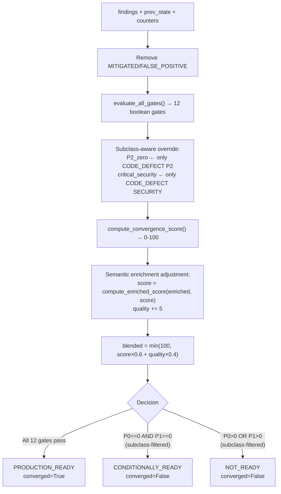

# Convergence Criteria — AURA v3.5

> **Verified from:** `src/aura/state_machine.py:360-452`, `src/aura/engine.py:636-749`, `src/aura/convergence.py:38-161`

## Convergence Decision



## Convergence Gates — Detailed Conditions

| Gate | Source | Condition | Non-blocking statuses |
|---|---|---|---|
| P0_zero | state_machine.py:406 | `len(OPEN/IN_PROGRESS P0) == 0` | DEFERRED, WAIVED, ACCEPTED_RISK, OUT_OF_SCOPE |
| P1_zero | state_machine.py:407 | `len(OPEN/IN_PROGRESS P1) == 0` | Same |
| P2_zero | state_machine.py:408 | `len(CODE_DEFECT OPEN/IN_PROGRESS P2) == 0` | Same + non-CODE_DEFECT |
| critical_security | state_machine.py:409 | All P0-P2 SECURITY in RESOLVED statuses | VERIFIED, DEFERRED, WAIVED, ACCEPTED_RISK, OUT_OF_SCOPE |
| critical_correctness | state_machine.py:410 | Same for CORRECTNESS | Same |
| data_integrity | state_machine.py:411 | Same for DATA_INTEGRITY | Same |
| regression | state_machine.py:412 | `len(reappeared findings) == 0` | N/A |
| verification | state_machine.py:413-416 | No findings in FIXED (unverified) state | N/A |
| no_material_new_findings | state_machine.py:417 | No NEW P0-P3 findings vs previous cycle | N/A |
| limitations_documented | state_machine.py:418 | File valid per `_validate_limitations_file()` | N/A |
| consecutive_clean_independent_audits | state_machine.py:419-421 | `consecutive_converged >= 2 AND audits_since_finding >= 2` | N/A |
| module_dependency_integrity | state_machine.py:422 | Always `True` | N/A |

## RESOLVED vs ACTIVE Statuses

**ACTIVE** (blocks P0/P1/P2_zero):
- OPEN, IN_PROGRESS, FIXED, VERIFYING, BLOCKED

**RESOLVED** (passes critical_security/correctness/data_integrity):
- VERIFIED, DEFERRED, WAIVED, ACCEPTED_RISK, OUT_OF_SCOPE

## Convergence Score Formula

```
gate_score   = int((passed_count / 12) × 60)
penalty      = P0_open × 15 + P1_open × 8 + P2_open × 3 + P3_plus_open × 1
finding_score = max(0, 40 - min(penalty, 40))
base_score   = min(100, gate_score + finding_score)

enriched_score = semantic.compute_enriched_score(enriched, base_score)
blended       = min(100, int(enriched_score × 0.6 + code_quality × 0.4))
```

### Example

Cycle with: 1 P0, 2 P1 open, 5/12 gates pass, quality=80
```
gate_score   = int(5/12 × 60) = 25
penalty      = 1×15 + 2×8 + 0×3 + 0×1 = 31
finding_score = max(0, 40 - 31) = 9
base_score   = min(100, 25 + 9) = 34
blended      = min(100, 34 × 0.6 + 80 × 0.4) = min(100, 20.4 + 32) = 52
```

## Cross-Document Consistency

All these diagrams and formulas must agree:

| Source | Score formula | Gate list |
|---|---|---|
| `state_machine.py:428-453` | `gate_score(0-60) + finding_score(0-40)` | 12 user-facing gates |
| `engine.py:688-693` | `semantic.adjust(score)` → `score×0.6 + quality×0.4` | Uses `evaluate_all_gates()` result |
| `convergence.py:150` | `passed/12 × 100` (simplified, internal only) | 12 internal gates (G01-G12) |

**Verified:** Engine uses `state_machine.compute_convergence_score()` THEN adjusts with semantic enrichment, then blends with code quality. ConvergenceJudge uses its own simplified scoring for internal autonomous loop decisions.