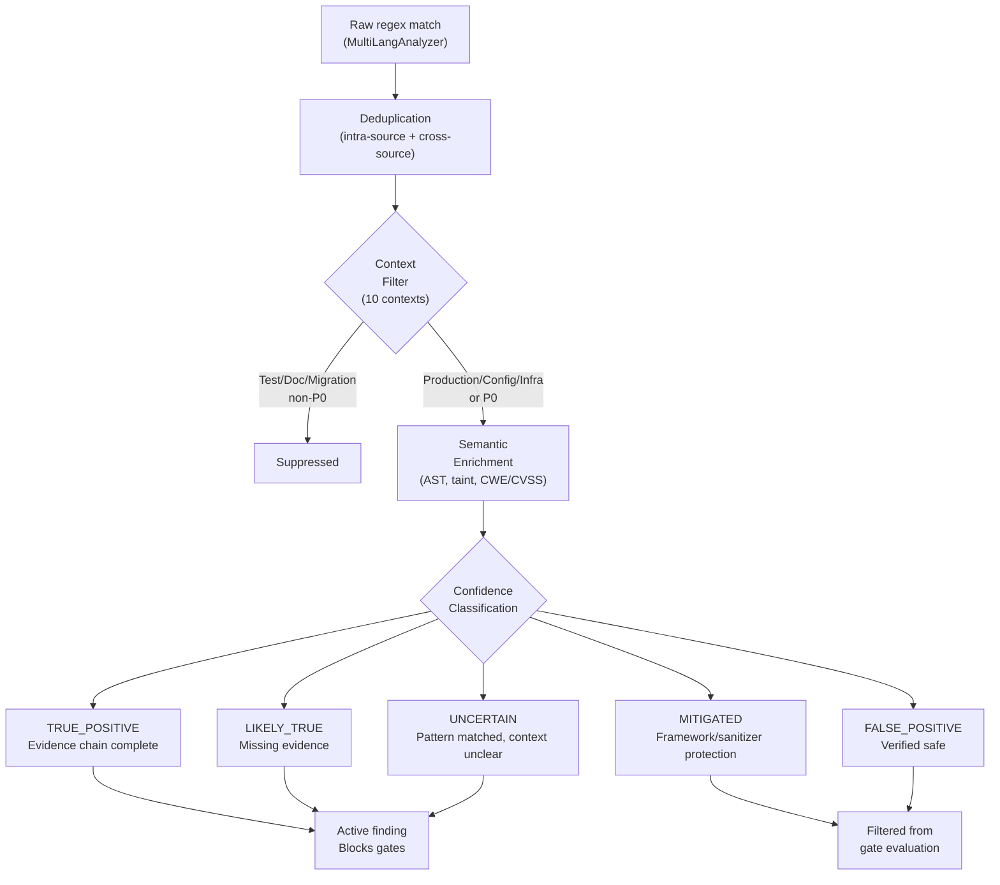

# Finding Validation — AURA v3.5

> **Verified from:** `src/aura/evidence.py`, `src/aura/state_machine.py`, `src/aura/execution_context.py`

## Validation Pipeline



## Evidence Requirements Per Finding Status

| Finding State | Evidence Required | Blocking? |
|---|---|---|
| OPEN | None | P0: blocks P0_zero, P1: blocks P1_zero, P2 (CODE_DEFECT): blocks P2_zero |
| IN_PROGRESS | None | Same as OPEN |
| FIXED | Patch applied, not yet independently verified | Blocks verification gate |
| VERIFYING | In verification process | |
| VERIFIED | Tool exit_code=0, verifier≠remediator (not self-verified), regression audit confirms absence | Not blocking |
| DEFERRED | Justification documented | Not blocking |
| WAIVED | Acceptance documented | Not blocking (terminal) |
| ACCEPTED_RISK | Risk assessment documented | Not blocking (terminal) |
| OUT_OF_SCOPE | Scope justification | Not blocking (terminal) |

## `is_blocking_for_gate()` Logic

```python
# finding_subclass.py:109-118
def is_blocking_for_gate(rule, gate_name):
    subclass = classify_finding(rule)
    return subclass in BLOCKING_SUBCLASSES  # only CODE_DEFECT
```

Only `CODE_DEFECT` findings block gates. Advisories, tooling failures, governance findings, code quality issues, and informational findings do NOT block — even if they have P0-P2 severity.

## Finding Subclass Classification

```python
# finding_subclass.py:90-106
def classify_finding(rule):
    # Exact match
    if rule in _RULE_TO_SUBCLASS:
        return _RULE_TO_SUBCLASS[rule]
    
    # Prefix match (e.g., "INJ-" → CODE_DEFECT)
    for prefix, subclass in _RULE_TO_SUBCLASS.items():
        if prefix.endswith("-") and rule.startswith(prefix):
            return subclass
    
    # Default
    return FindingSubclass.CODE_DEFECT
```

**Key decision:** Unknown/novel rules default to CODE_DEFECT — this is the conservative/fail-safe approach. A new injection vector not in the registry will be treated as a real defect. Only known advisory patterns get downgraded.

## Evidence Quality Grading

```python
# evidence.py:172-211
def grade_evidence_quality(evidence_list):
    verified_entries = count(level=VERIFIED)
    regression_entries = count(level=REGRESSION_TESTED)
    tool_passed = count(exit_code==0, tool exists)
    
    score = 0
    if verified > 0: score += 50
    if regression > 0: score += 20
    if tool_passed > 0: score += min(20, tool_passed * 5)
    
    grade = A(≥90) | B(≥70) | C(≥50) | D(≥30) | F(<30)
```

## False-Convergence Prevention

The system has 4 self-test campaigns (`SelfTestCampaigns` in `adversarial.py:655-734`):

1. **Adversarial campaign**: Tests regex detection of known patterns (hardcoded keys, injection, bare except)
2. **False convergence campaign**: Tests that forbidden state transitions are blocked (OPEN→VERIFIED, NOT_READY→PRODUCTION_READY)
3. **False evidence campaign**: Tests that self-verified evidence is rejected, tool-failed evidence is rejected, valid evidence is accepted
4. **Git safety campaign**: Tests gitignore coverage for sensitive files

These campaigns are NOT executed as part of the audit pipeline — they are standalone tests used during development.