# DFD — README

Data Flow Diagrams for the AURA audit engine.

| Document | Scope |
|---|---|
| [level-0.md](level-0.md) | Context-level: external entities, core processes, data stores |
| [level-1.md](level-1.md) | 13-phase audit pipeline decomposition with detailed data flows |

## Audit Data Flow (High-Level)

```mermaid
graph LR
    REPO["Target Project\n(source files)"] --> DISCOVER["DISCOVER\n(git, language detection)"]
    DISCOVER --> MODEL["MODEL\n(project type, structure)"]
    MODEL --> AUDIT["AUDIT\n(regex scanning, 650+ rules)"]
    AUDIT --> ADV["ADVERSARIAL\n(domain auditors, 12 roles)"]
    AUDIT --> CORRELATE["CORRELATE\n(dedup, normalize, context filter)"]
    ADV --> CORRELATE
    CORRELATE --> PRIORITIZE["PRIORITIZE\n(sort by severity)"]
    PRIORITIZE --> FINDING["Finding\n(INSERT into DB)"]
    FINDING --> CONVERGENCE["CONVERGENCE\n(12 gates, score, classification)"]
    CONVERGENCE --> REPORT["Report\n(stdout/markdown file)"]
```

