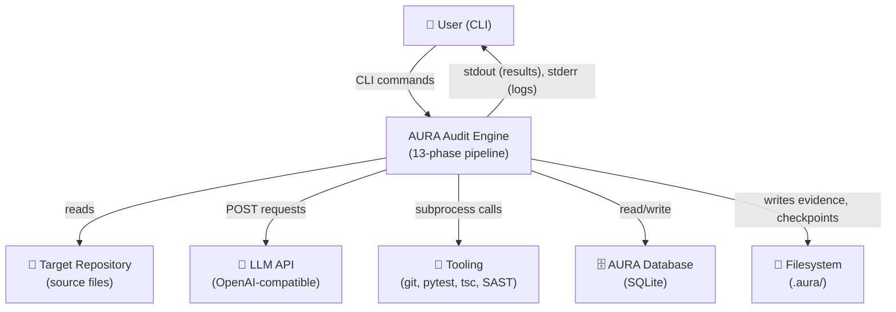

# DFD Level 0 — AURA v3.5

> **Verified from:** `src/aura/engine.py:112-144`, `src/aura/db.py`, `src/aura/analyzer.py:456-509`

## Level 0: Context Diagram

## Processes

| ID | Process | Source | Description |
|---|---|---|---|
| P1 | CLI Dispatch | `cli.py:89-111` | Parse CLI args, load config, route to subcommand |
| P2 | Initialize | `engine.py:87-91` | Create DB schema, init cycle 1 |
| P3 | 13-Phase Audit | `engine.py:112-144` | Sequential execution of 13 phases |
| P4 | Autonomous Loop | `remediation.py:244-579` | Audit→Fix→Verify→Re-audit until convergence |
| P5 | Report Generation | `engine.py:1046-1077` | Generate markdown report from DB |

## Data Stores

| ID | Store | Table/File | Persistence |
|---|---|---|---|
| DS1 | cycles | `cycles` table | `.aura/state/aura.db` |
| DS2 | findings | `findings` table | `.aura/state/aura.db` |
| DS3 | convergence | `convergence` table | `.aura/state/aura.db` |
| DS4 | gates | `gates` table | `.aura/state/aura.db` |
| DS5 | tooling_evidence | `tooling_evidence` table | `.aura/state/aura.db` |
| DS6 | audit_log | `audit_log` table | `.aura/state/aura.db` |
| DS7 | evidence_chain | `evidence_chain` table | `.aura/state/aura.db` |
| DS8 | checkpoint | `.aura/checkpoint.json` | `.aura/checkpoint.json` |
| DS9 | cycle_evidence | `.aura/evidence/cycle-NNN/` | Filesystem |

## External Entities

| ID | Entity | Type |
|---|---|---|
| E1 | Human User | Actor |
| E2 | Target Repository | Data Source |
| E3 | LLM API | External Service |
| E4 | Local Ollama (optional) | External Service |
| E5 | git CLI | System Tool |
| E6 | SAST Tools | System Tool |
| E7 | Language Tooling | System Tool |