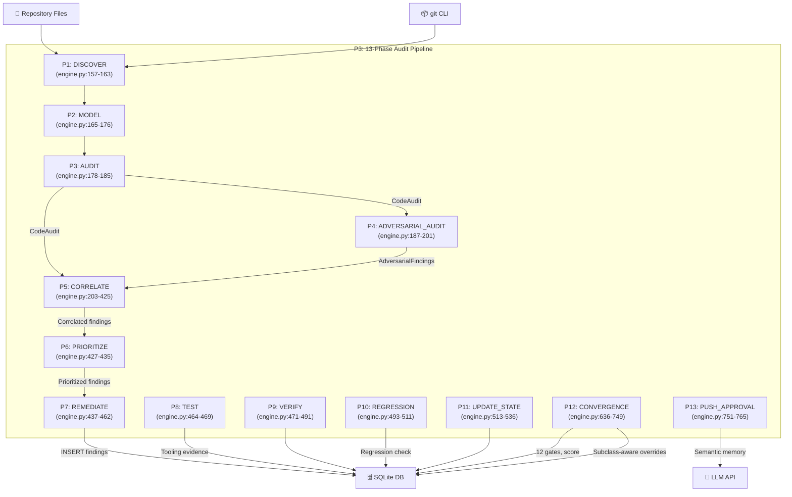

# DFD Level 1 — AURA v3.5

> **Verified from:** `src/aura/engine.py:112-144`, phase implementations at lines 157-766

## Level 1: 13-Phase Audit Pipeline (Process P3 Decomposition)

## Data Flows — Detailed

### Phase 1: DISCOVER
- **Input:** Repository root (filesystem), git CLI
- **Processing:** `_get_git_context()` — git branch, recent commits, status, file count
- **Processing:** `_detect_languages()` — count files per extension
- **Output → ctx:** `ctx["git"]`, `ctx["languages"]`
- **Output → DB:** `insert_audit_log("DISCOVER", ...)`

### Phase 2: MODEL
- **Input:** `ctx["languages"]`, `ctx["git"]`
- **Processing:** `_detect_project_type()` — check manifest files
- **Output → ctx:** `ctx["model"]` — project type, language list, file count
- **Output → DB:** `insert_audit_log("MODEL", ...)`

### Phase 3: AUDIT
- **Input:** Repository files (rglob over repo_root)
- **Processing:** `MultiLangAnalyzer.analyze()` — regex scans 127 rules across 51 language groups
- **Skip dirs:** 30+ directories (node_modules, .git, __pycache__, etc.)
- **Skip files:** test files, lockfiles
- **Quality score:** `100 - (P0×15 + P1×8 + P2×3) / KLOC`
- **Output → ctx:** `ctx["code_audit"]` = `CodeAudit(findings, files_analyzed, total_lines, quality_score)`
- **Output → DB:** `insert_audit_log("AUDIT", ...)`

### Phase 4: ADVERSARIAL_AUDIT
- **Primary:** `DomainAuditOrchestrator.run_all_legacy()` — Wave 1 domains (11 auditors)
- **Fallback:** `AdversarialAuditor.run_all()` — 12 legacy roles
- **Output → ctx:** `ctx["adversarial"]` = dict[name → list[AdversarialFinding]]

### Phase 5: CORRELATE
- **Processing:** Cross-rule normalization (domain→primary rule mapping)
- **Processing:** Intra-source dedup (within primary, within adversarial)
- **Processing:** Cross-source overlap detection (primary ∩ adversarial)
- **Processing:** Global deduplication (file:line:rule canonical key)
- **Processing:** Execution context filtering (suppress test/doc/migration findings)
- **Processing:** Semantic enrichment (AST, taint, confidence levels)
- **Invariant:** `combined_raw - intra_dupes - cross_overlap = unique`
- **Output → ctx:** `ctx["correlated"]`, `ctx["correlation_stats"]`, `ctx["semantic_enriched"]`
- **Output → DB:** `insert_audit_log("CORRELATE", ...)`

### Phase 6: PRIORITIZE
- **Input:** `ctx["correlated"]`
- **Processing:** Sort by severity (P0→P5), then category
- **Output → ctx:** `ctx["prioritized"]`, `ctx["findings_list"]`

### Phase 7: REMEDIATE
- **Processing:** Convert correlated + ancillary findings to DB dicts
- **Ancillary findings:** Git errors, uncommitted changes, language info
- **Test coverage:** Scanned separately (not in CORRELATE phase — prevents double-counting)
- **Output → DB:** `insert_finding()` for each finding
- **Output → DB:** `insert_audit_log("REMEDIATE", ...)`

### Phase 8: TEST
- **Processing:** `_run_tooling()` — execute SAST + language tooling
- **Auto-detect:** semgrep, bandit, gitleaks, tsc, pytest, npm test, go test, cargo test
- **Platform:** `cmd /c` on Windows, `sh -c` on Unix
- **Timeout:** 300s per command
- **Output → DB:** `insert_tooling_evidence()` for each command
- **Output → ctx:** `ctx["tooling_results"]`

### Phase 9: VERIFY
- **Input:** `ctx["findings_list"]`, `ctx["tooling_results"]`
- **Processing:** Track which findings have independent verification evidence
- **Rule:** Tooling passing globally ≠ individual finding verified
- **Output → DB:** `insert_audit_log("VERIFY", ...)`

### Phase 10: REGRESSION
- **Input:** Previous cycle findings from DB
- **Processing:** Check if previously FIXED/VERIFIED findings reappeared
- **Match:** `finding_id` intersection with current P0-P2 findings
- **Output → ctx:** `ctx["regressions"]`

### Phase 11: UPDATE_STATE
- **Processing:** Compute severity counts, code quality, tooling stats, regression count
- **Output → ctx:** `ctx["state_update"]`
- **Output → DB:** `insert_audit_log("UPDATE_STATE", ...)`

### Phase 12: CONVERGENCE
- **Processing:** Validate LIMITATIONS.md presence and content quality
- **Processing:** Filter semantically mitigated findings (MITIGATED, FALSE_POSITIVE)
- **Processing:** Evaluate all 12 gates via `evaluate_all_gates()`
- **Processing:** Subclass-aware gate overrides (CODE_DEFECT only blocks P2_zero)
- **Processing:** Compute convergence score (gate score × 0.6 + code quality × 0.4)
- **Processing:** Classify: PRODUCTION_READY / CONDITIONALLY_READY / NOT_READY
- **Output → DB:** `upsert_gate()` × 12, `upsert_convergence()`

### Phase 13: PUSH_APPROVAL
- **Processing:** Store semantic memory for next cycle
- **Output → DB:** `insert_audit_log("PUSH_APPROVAL", ...)`