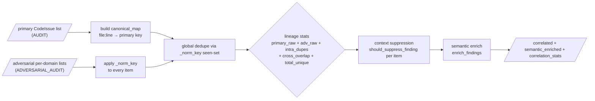

# DFD Level 1 — CORRELATE → CONVERGENCE internals

> Zoom into phases 5 (CORRELATE) and 12 (CONVERGENCE), which hold all non-trivial invariants.

## Level 1a — CORRELATE (engine.py:242-464)



Invariant verified in code (engine.py:438-444): the lineage string is written to
audit_log with the EXACT arithmetic form
`Primary: {p} + Adversarial: {a} = {total_raw} combined / Intra-dupes + / Cross-overlap + /
Total removed → {total_unique} unique`. Historical input-validation bug (36+4≠41) is
prevented by recomputing all values from the dedupe maps, not by manual addition.

## Level 1b — CONVERGENCE (engine.py:678-813)

```mermaid
flowchart TD
    A[/findings_list/] --> M[semantic_mitigation_filter<br/>drop MITIGATED & FALSE_POSITIVE ids<br/>(confidence_level names from semantic.py)]
    M --> RI[re-inject rule: from problem text if missing]
    RI --> G0[evaluate_all_gates<br/>findings, cycle, cons, audits,<br/>prev_findings, module_integrity,<br/>limitations_documented, regression_pass]
    G0 --> TV{tooling_passed?}
    TV -- no --> G1[verification := False]
    TV -- yes --> G2
    G1 --> G2[upsert_gate ×12 (DB)]
    G2 --> SC[compute_convergence_score<br/>severity_weights → normalized penalties]
    SC --> B[blended = int(0.6*score + 0.4*quality)]
    B --> SB{SUBCLASS OVERRIDE<br/>re-compute P2_zero &<br/>critical_security with is_blocking_for_gate}
    SB --> G3[upsert_gate ×12 again (subclass evidence)]
    G3 --> OP[open_p0 / open_p1 counts (CODE_DEFECT only)]
    OP --> CLS{classification}
    CLS -- "all 12 gates pass" --> PR[PRODUCTION_READY, converged=True]
    CLS -- "op0=0 AND op1=0" --> CR[CONDITIONALLY_READY, converged=False]
    CLS -- else --> NR[NOT_READY, converged=False]
    PR --> W[upsert_convergence + insert Evidence entry]
    CR --> W
    NR --> W
    W --> AL[audit_log CONVERGENCE]
```

## 12 user-facing gates evaluated here (state_machine.GATE_NAMES + evaluate_all_gates)

1. `P0_zero`, `P1_zero`, `P2_zero` — count of severities in ACTIVE_STATUSES (OPEN, IN_PROGRESS, FIXED, VERIFYING, BLOCKED) = 0; subclass override for `P2_zero` restricts to CODE_DEFECT.
2. `critical_security`, `critical_correctness`, `data_integrity` — all findings in respective category/severity are in a RESOLVED_STATUS (VERIFIED/DEFERRED/WAIVED/ACCEPTED_RISK/OUT_OF_SCOPE).
3. `regression` — `regression_pass` from `_phase_regression` (resolved∩current = ∅).
4. `verification` — no findings still in FIXED.
5. `no_material_new_findings` — no new `finding_id` (id or finding_id, `_finding_key`) in P0-P3 vs previous cycle.
6. `limitations_documented` — from `_validate_limitations_file` (existence + ≥50 chars + non-placeholder + has ## section + bullet list).
7. `consecutive_clean_independent_audits` — `consecutive_converged_cycles ≥ 2 AND audits_since_last_finding ≥ 2`.
8. `module_dependency_integrity` — from `_check_module_integrity()` import probe (fail-closed).

## Observability & forensic artefacts written in CONVERGENCE

- gates ×12 rows (first pass raw + second pass subclass) — `db.upsert_gate`.
- convergence row — `db.upsert_convergence`.
- hash-linked Evidence entry — `self.evidence_chain.append(...)` and mirror via `db.insert_evidence_entry` (R2-08).
- audit_log CONVERGENCE row with classification + score + gate tally.
