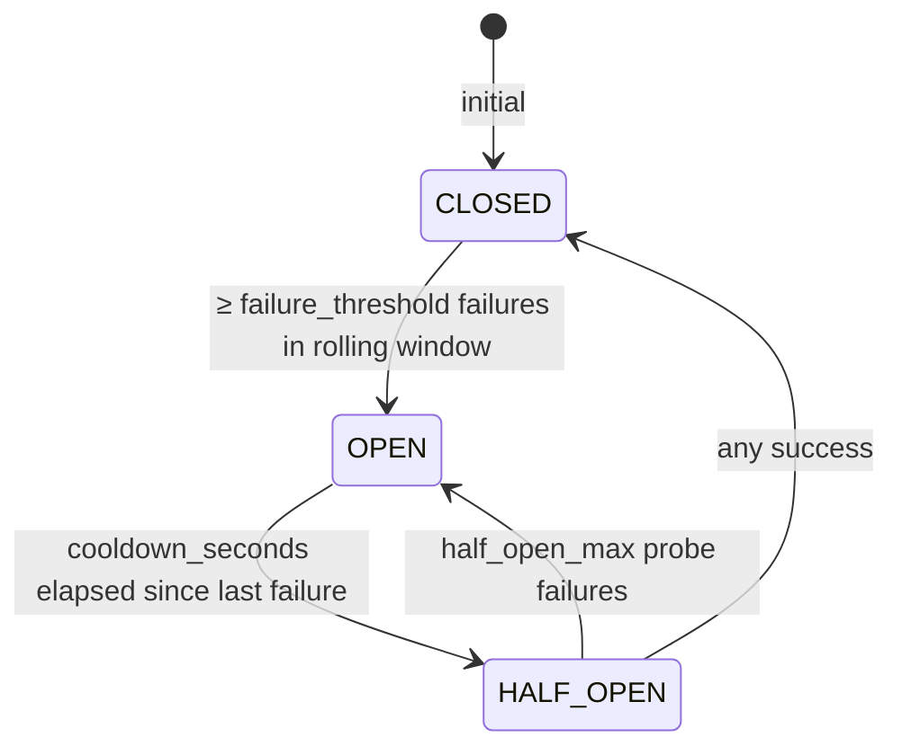

# Failure/Recovery — Circuit Breaker

> Source: `src/aura/providers.py:56-118`.

## State machine

Defaults (`CircuitBreaker.__init__` L59-64):
- `failure_threshold = 3`
- `cooldown_seconds = 30.0`
- `half_open_max = 1`
- `rolling_window_seconds = 120.0`

## Behaviour (verified from implementation)

- **CLOSED**: all requests allowed; failures are timestamped inside a rolling
  120 s window. When window count ≥ threshold, transition to OPEN (L97-102).
- **OPEN**: `allow_request` returns False immediately (fail-fast without network call).
  After `cooldown_seconds` since `_last_failure_time`, ONE probe is admitted by moving
  to HALF_OPEN and zeroing `_half_open_attempts` (L104-111).
- **HALF_OPEN**: success closes (`record_success` zeroes attempts, sets CLOSED, prunes
  timestamps outside window L79-86). Failure increments `_half_open_attempts`; reaching
  `half_open_max` re-opens (L97-101).

## Health derivation (used by ProviderRegistry)

`BaseProvider.status` (L134-149) maps:
- CLOSED → HEALTHY
- HALF_OPEN → DEGRADED
- OPEN → UNHEALTHY

`get_healthy_provider()` returns the first provider in `_priority_order` whose circuit
is not OPEN (L306-311).

## Design notes (as-built)

- The breaker counts each *call*, not per-endpoint — it is instantiated per provider.
- Timestamps outside the rolling window are pruned on both success and failure paths,
  so a stale streak cannot re-open the breaker.
- `reset()` clears everything (`providers.py:115-118`) — used by tests.
