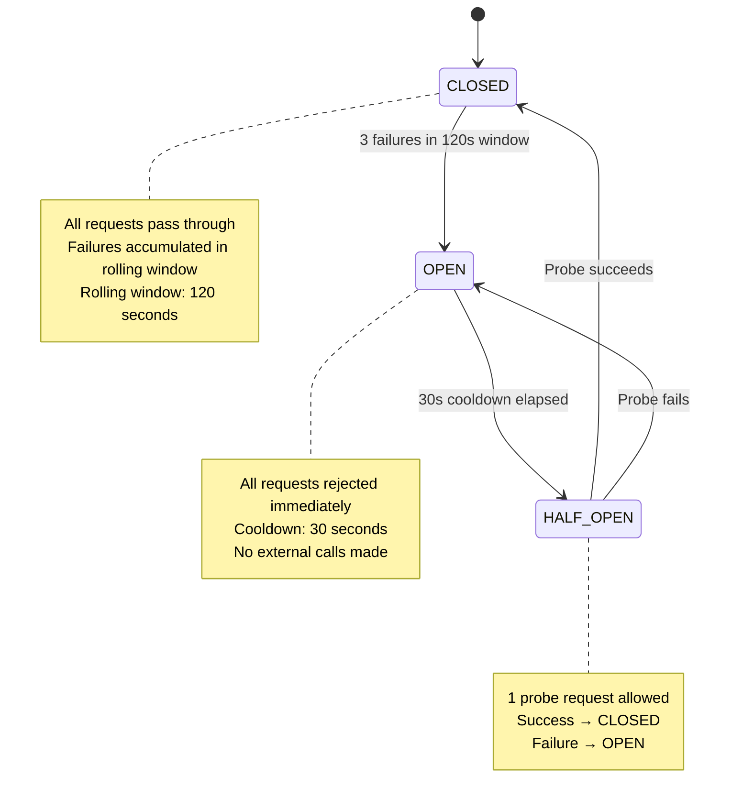

# Circuit Breaker & Provider Failover — AURA v3.5

> **Verified from:** `src/aura/providers.py:56-306`

## Circuit Breaker State Machine



## Provider Registry & Fallback

```mermaid
graph TD
    REQUEST["chat_with_fallback()"] --> GET["get_healthy_provider()"]
    GET --> CHECK_PRI["Check providers by priority order"]
    
    CHECK_PRI --> P1{"Primary\n(priority=0)\nCircuit CLOSED?"}
    P1 -->|Yes| USE_P1["Use primary provider"]
    P1 -->|No (OPEN)| P2{"Fallback: Ollama\n(priority=1)\nAvailable + CLOSED?"}
    P2 -->|Yes| USE_P2["Use Ollama fallback"]
    P2 -->|No (OPEN or not found)| P3{"Any other\nprovider?"}
    P3 -->|Yes| USE_PN["Use next available"]
    P3 -->|No| ALL_DOWN["Return error:\n'All providers unhealthy'"]
    
    USE_P1 --> CALL["provider.chat()"]
    USE_P2 --> CALL
    USE_PN --> CALL
    
    CALL --> WRAP["_wrap_call()"]
    WRAP --> CB{"Circuit.allow_request()?"}
    CB -->|No| CB_ERR["record_failure()\nreturn error"]
    CB -->|Yes| API_CALL["Actual API call"]
    API_CALL --> RESULT{Success?}
    RESULT -->|Yes| SUCCESS["record_success()\nreturn ProviderResponse"]
    RESULT -->|No| REC_FAIL["record_failure()\nincrement failure_count\nreturn ProviderResponse with error"]
    
    REC_FAIL --> CHECK_THRESH{"failures ≥ threshold\n(3 in 120s window)?"}
    CHECK_THRESH -->|Yes| TRIP["Circuit → OPEN"]
```

## Provider Health States

```python
class ProviderHealth(str, Enum):
    HEALTHY = "healthy"       # Circuit CLOSED
    DEGRADED = "degraded"     # Circuit HALF_OPEN
    UNHEALTHY = "unhealthy"   # Circuit OPEN
    UNKNOWN = "unknown"       # No status data (unregistered)
```

**Source:** `src/aura/providers.py:19-23`

## Auto-Discovery of Ollama Fallback

The `auto-fix` CLI command attempts to auto-discover a local Ollama instance:

```python
# cli.py:542-561
ollama_host = os.environ.get("OLLAMA_HOST", "http://localhost:11434")
resp = httpx.get(f"{ollama_host}/api/tags", timeout=3)
if resp.status_code == 200:
    models = resp.json().get("models", [])
    if models:
        fallback_model = models[0].get("name", "llama3")
        ollama_provider = OpenAICompatibleProvider(
            name="ollama-fallback",
            base_url=f"{ollama_host}/v1",
            api_key="ollama",
            model=fallback_model,
            timeout=timeout,
        )
        registry.register(ollama_provider, priority=1)
```

**Status:** Auto-discovery happens once at startup; if Ollama is not running or returns an error, no fallback is registered.

## Provider Failover Matrix

| Scenario | Primary Status | Fallback Status | Result |
|---|---|---|---|
| Primary healthy | CLOSED | N/A | Use primary |
| Primary degraded | HALF_OPEN | N/A | Use primary (probe request) |
| Primary unhealthy, fallback healthy | OPEN | CLOSED | Use fallback |
| Primary unhealthy, fallback unhealthy | OPEN | OPEN | All providers unhealthy → error |
| Primary healthy, fallback healthy | CLOSED | CLOSED | Use primary (higher priority) |
| No providers registered | — | — | All providers unhealthy → error |

## Operator Visibility

The `auto-fix` CLI command displays provider health at the end of the run:

```python
# cli.py:640-644
statuses = registry.get_all_statuses()
console.print(f"[dim]Provider health: " +
    ", ".join(f"{k}: {v.health.value}" for k, v in statuses.items()) + "[/dim]")
```

## Recovery Scenarios

### Scenario 1: Primary Provider Rate Limited
1. HTTP 429 → retry with exponential backoff (3 attempts)
2. If all retries fail → `record_failure()`
3. After 3 failures → circuit OPEN
4. Next request → skip primary → use Ollama fallback
5. After 30s cooldown → circuit HALF_OPEN → probe request
6. Probe succeeds → circuit CLOSED → primary recovers

### Scenario 2: All Providers Down
1. Primary circuit OPEN (3 failures)
2. Ollama not detected at startup
3. `get_healthy_provider()` → None
4. `chat_with_fallback()` → `ProviderResponse(error="All providers unhealthy")`
5. `AutonomousRemediationLoop` detects error → `safeguard_stop`

### Scenario 3: Intermittent Failures
1. Primary: succeed, fail, succeed, fail, fail
2. 3 failures in rolling window → circuit OPEN
3. Fallback: auto-discovered → takes over
4. After 30s: primary → HALF_OPEN
5. Probe succeeds → CLOSED (but still 2 old failures in window → may re-trip quickly)
6. Rolling window prunes old failures as they age >120s → stabilizes