# Error Flow — AURA v3.5

> **Verified from:** `src/aura/errors.py`, `src/aura/engine.py`, `src/aura/providers.py`, `src/aura/remediation.py`

## Error Taxonomy

```python
# errors.py
class ErrorCategory(str, Enum):
    CONFIGURATION, VALIDATION, AUTHENTICATION, AUTHORIZATION,
    NETWORK, TIMEOUT, RATE_LIMIT, PROVIDER, DEPENDENCY,
    DATABASE, PARSING, INTERNAL, NOT_FOUND, STATE_MACHINE

class ErrorSeverity(str, Enum):
    FATAL   # Cannot continue — exit process
    ERROR   # Operation failed — log and continue/skip
    WARNING # Non-blocking issue — log and continue
    INFO    # Informational

class RetryDecision(str, Enum):
    RETRY               # Transient failure, retry with backoff
    NO_RETRY            # Permanent failure, do not retry
    RETRY_WITH_FALLBACK # Retry, then fall back to alternative
```

## Error Propagation Map

```mermaid
graph TD
    subgraph "CLI Layer"
        CLI_ERR["ConfigError → sys.exit(1)"]
        CLI_AURA["AuraError → console.print → sys.exit(1)"]
    end
    
    subgraph "Engine Layer"
        ENG_INIT["initialize() → DB schema migration"]
        ENG_PHASE["run_audit() → 13 phases"]
        ENG_GIT["_get_git_context() → subprocess"]
        ENG_TOOLS["_run_tooling() → subprocess"]
    end
    
    subgraph "Analysis Layer"
        ANALYZER["MultiLangAnalyzer.analyze() → file I/O errors"]
        DOMAIN["DomainAuditOrchestrator → fallback to AdversarialAuditor"]
        SEMANTIC["SemanticAuditor.enrich_findings() → sets empty enriched list"]
    end
    
    subgraph "LLM Layer"
        LLM_CLIENT["LLMClient.chat() → LLMResponse with error string"]
        PROVIDER["OpenAICompatibleProvider → retry × 3 → ProviderResponse with error"]
        CB["CircuitBreaker → OPEN state → skip provider"]
    end
    
    subgraph "Remediation Layer"
        AUTOFIXER["AutoFixer.apply_fix() → FixResult(success=False, error=...)"]
        DEAD_LETTER["Dead letter queue → insert_dead_letter()"]
        ROLLBACK["AutoFixer.rollback() → restore all backups"]
    end
    
    CLI_ERR -->|"FATAL"| EXIT["sys.exit(1)"]
    CLI_AURA -->|"depends on severity"| EXIT
    
    ENG_GIT -->|"Exception → GitError=True"| ENG_PHASE
    ENG_TOOLS -->|"TimeoutExpired → success=False"| ENG_PHASE
    ENG_TOOLS -->|"Exception → success=False"| ENG_PHASE
    
    ANALYZER -->|"OSError → continue"| ENG_PHASE
    DOMAIN -->|"Exception → use legacy auditor"| ENG_PHASE
    SEMANTIC -->|"Exception → ctx[semantic_enriched] = []"| ENG_PHASE
    
    LLM_CLIENT -->|"HTTP error → LLMResponse with LLM_ERROR"| CALLER
    PROVIDER -->|"429 rate limit → retry(2^n)"| CALLER
    PROVIDER -->|"Circuit OPEN → ProviderResponse error"| CALLER
    CB -->|"3 failures → OPEN"| PROVIDER
    
    AUTOFIXER -->|"Sandbox reject → error in FixResult"| DEAD_LETTER
    AUTOFIXER -->|"Parse error → unparseable"| DEAD_LETTER
    AUTOFIXER -->|"Tooling fail → rollback()"| ROLLBACK
```



## Fail-Open vs Fail-Closed Decisions

| Scenario | Behavior | Type |
|---|---|---|
| Config validation fails | Exit immediately (sys.exit(1)) | Fail-Closed ✓ |
| DB not initialized | RuntimeError raised | Fail-Closed ✓ |
| Git not available | GitError=True, audit continues without git context | Fail-Open |
| Language detection fails | Empty dict, continue | Fail-Open |
| Domain orchestrator fails | Fallback to legacy 12-role auditor | Fail-Open (degraded) |
| Semantic enrichment fails | `semantic_enriched = []`, continue | Fail-Open |
| Tooling command times out | Record failure, continue | Fail-Open |
| LLM API returns error | Record in ProviderResponse.error | Fail-Open |
| Circuit breaker OPEN | Skip provider, try fallback | Fail-Open (degraded) |
| AutoFixer sandbox rejects | Record in dead letter queue, skip | Fail-Closed ✓ |
| Fix old_code mismatch | Record failure, retry with file content | Fail-Closed (retry before fail) |
| Tooling fails after fixes | Rollback all changes | Fail-Closed ✓ |
| Gate flip false→true without evidence | State machine violation | Fail-Closed ✓ |
| Score regression | State machine violation | Fail-Closed ✓ |
| Illegal state transition | State machine violation | Fail-Closed ✓ |

## Graceful Degradation Paths

```
Normal: DomainAuditOrchestrator (40 domains, Wave 1)
  ↓ Failure
Fallback 1: AdversarialAuditor (12 legacy roles)
  ↓ Failure
Fallback 2: Empty ctx["adversarial"], continue pipeline

Normal: SemanticAuditor.enrich_findings()
  ↓ Failure
Fallback: ctx["semantic_enriched"] = [], continue with regex-only findings

Normal: OpenAICompatibleProvider (primary)
  ↓ Circuit OPEN
Fallback 1: Ollama (if detected)
  ↓ Also OPEN
Fallback 2: ProviderResponse(error="All providers unhealthy")
```