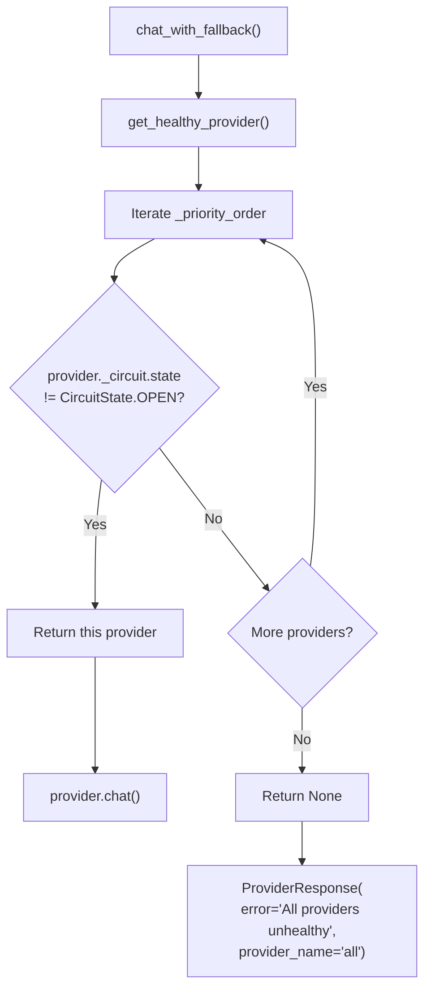

# Provider Failover — AURA v3.5

> **Verified from:** `src/aura/providers.py:270-306`

This is documented in detail in [circuit-breaker.md](circuit-breaker.md).

## Provider Registry Architecture

```python
class ProviderRegistry:
    """
    Registry of LLM providers with health tracking and fallback routing.
    
    - _providers: dict[name → BaseProvider]
    - _priority_order: list[name]  # lower index = higher priority
    """
```

## Failover Flow



## Supported Providers

| Provider | Priority | Registration | Circuit Breaker |
|---|---|---|---|
| Primary (OpenAI-compatible) | 0 | Manual via CLI `--llm-url` + `--llm-key` | Per-provider CircuitBreaker |
| Ollama fallback | 1 | Auto-detected via `GET /api/tags` | Per-provider CircuitBreaker |

## Failover Scenarios

### Scenario 1: Primary Fails, Fallback Takes Over
```
1. Primary → OPEN (3 failures)
2. chat_with_fallback() → get_healthy_provider()
3. Skip primary (OPEN) → check Ollama
4. Ollama CLOSED → use Ollama
5. Ollama handles all requests until primary recovers
```

### Scenario 2: Both Providers Down
```
1. Primary → OPEN
2. Ollama → OPEN
3. get_healthy_provider() → None
4. Return ProviderResponse(error="All providers unhealthy")
5. AutonomousRemediationLoop detects error → safeguard_stop
```

### Scenario 3: Primary Recovers
```
1. Primary → OPEN (30s cooldown elapsed)
2. Primary → HALF_OPEN (probe request allowed)
3. Probe succeeds → Primary → CLOSED
4. Next request: get_healthy_provider() returns Primary (higher priority)
5. Ollama no longer used (but stays registered as fallback)
```

## Health Status Visibility

```python
# CLI: shows provider health at end of auto-fix run
statuses = registry.get_all_statuses()
# → {"primary": ProviderStatus(health=HEALTHY, circuit=CLOSED, ...),
#    "ollama-fallback": ProviderStatus(health=UNHEALTHY, circuit=OPEN, ...)}
```