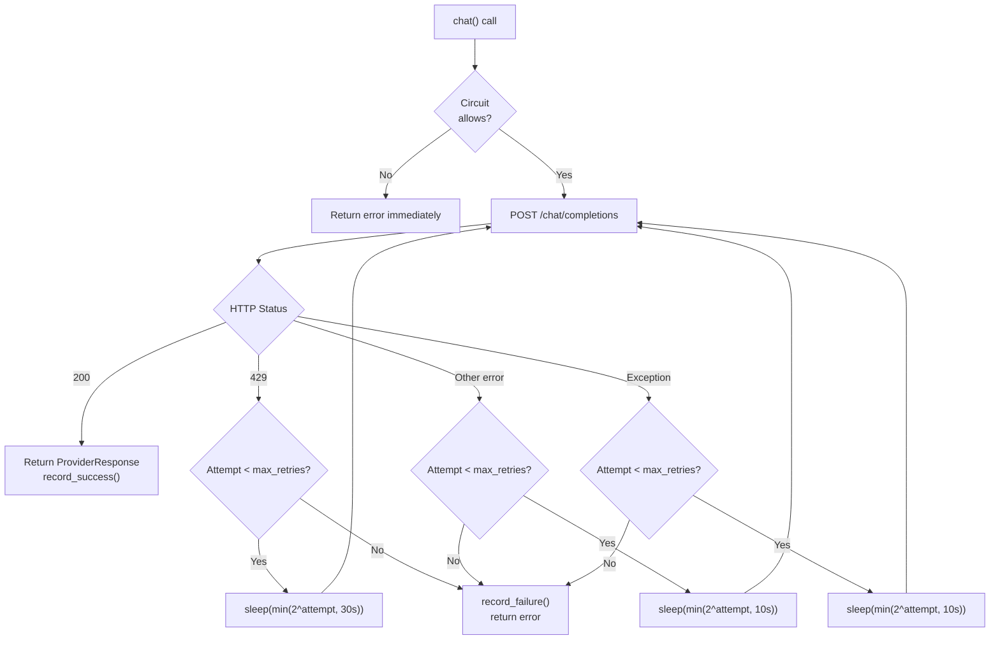

# Retry Strategy — AURA v3.5

> **Verified from:** `src/aura/providers.py:195-267`, `src/aura/convergence.py:163-235`, `src/aura/remediation.py:435-498`

## LLM Provider Retry



**Config:** `max_retries=3`, exponential backoff with caps:
- Rate limit (429): `min(2^n, 30)`
- Other HTTP errors: `min(2^n, 10)`
- Network exceptions: `min(2^n, 10)`

**Source:** `src/aura/providers.py:215-265`

## Autonomous Loop Safeguard Retry Limits

```python
class LoopSafeguard:
    MAX_ITERATIONS = 10           # Hard cap on total cycles
    MAX_SAME_FINDING_ATTEMPTS = 3 # Per-finding fix retry limit
    NO_PROGRESS_CYCLES = 3        # Consecutive cycles without improvement
    REGRESSION_THRESHOLD = -10    # Score drop threshold
```

**Source:** `src/aura/convergence.py:172-175`

## AutoFixer Retry with File Content

When the first fix attempt fails because `old_code` doesn't match actual file content:

1. First attempt: LLM generates fix with its best-guess `old_code`
2. If mismatch: Read actual file content at ±5 lines around target
3. Second attempt: Send ACTUAL content to LLM with instruction to generate CORRECTED `old_code`
4. If second attempt also fails: Record failure, move to next finding

```python
# remediation.py:435-498
if not fr.success and current_attempts <= 0:
    actual_content = read_file(repo_root / file_path)
    # Build context: ±5 lines around target
    retry_prompt = fix_prompt + "\nACTUAL FILE CONTENT:\n" + actual_context
    retry_resp = llm.chat("...CORRECTED old_code...", retry_prompt)
    fr2 = fixer.apply_fix(retry_data)
```

**Max retries per finding per cycle:** 2 (initial + 1 retry with actual content)

## Dead Letter Queue

Failed/unparseable LLM responses are stored in the `dead_letter` table:

```sql
CREATE TABLE dead_letter (
    finding_id TEXT NOT NULL,
    cycle_number INTEGER NOT NULL,
    attempt_number INTEGER NOT NULL DEFAULT 1,
    error_type TEXT NOT NULL CHECK(
        error_type IN ('UNPARSEABLE','TIMEOUT','PROVIDER_ERROR',
                       'INVALID_FIX','SANDBOX_REJECTED','UNKNOWN')
    ),
    raw_response TEXT,     -- LLM response (first 5000 chars)
    recovery_hint TEXT,    -- Human-readable fix suggestion
    status TEXT NOT NULL DEFAULT 'PENDING'
        CHECK(status IN ('PENDING','RETRIED','RESOLVED','ABANDONED')),
)
```

**Source:** `src/aura/db.py:157-168,512-530`

## Retry Decision Table

| Error Type | Retry? | Max Attempts | Backoff Strategy |
|---|---|---|---|
| HTTP 429 (Rate Limit) | Yes | 3 | `min(2^n, 30s)` |
| HTTP !=200 (!=429) | Yes | 3 | `min(2^n, 10s)` |
| Network Exception | Yes | 3 | `min(2^n, 10s)` |
| LLM JSON Parse Error | No | N/A | Dead letter queue |
| Sandbox Rejection | No | N/A | Dead letter queue |
| Old Code Mismatch | Yes (1 retry) | 2 | Immediate retry with actual content |
| Tooling Failure After Fixes | No | N/A | Rollback all fixes |
| Configuration Error | No | N/A | Exit (FATAL) |
| Database Error | Yes (1 retry + fallback) | N/A | RETRY_WITH_FALLBACK decision |
| State Machine Violation | No | N/A | Error logged, blocked |
| Timeout (subprocess) | No | N/A | Record failure, continue |