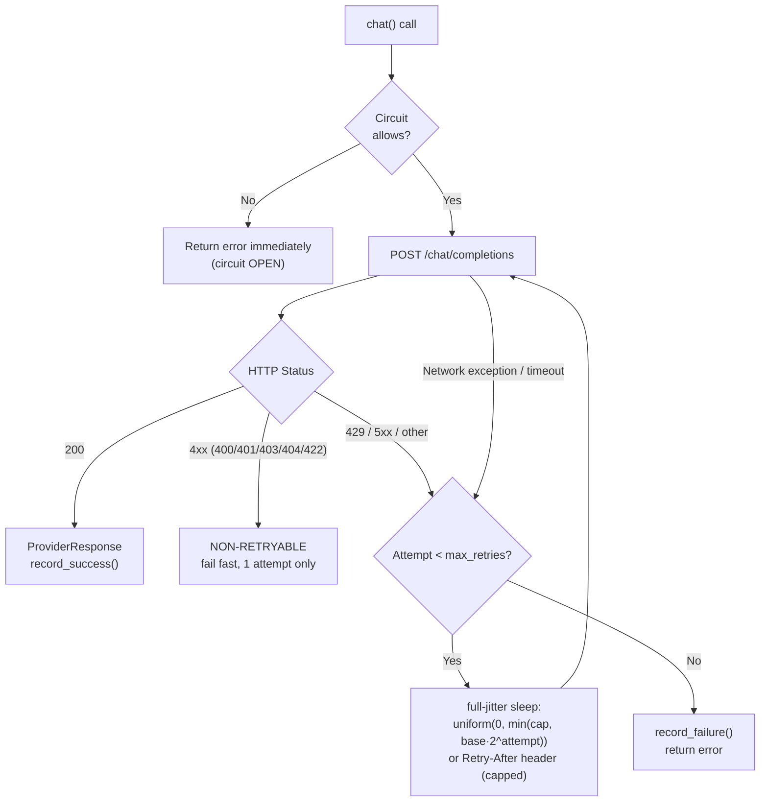

# Retry Strategy — AURA v3.5.x

> **Verified from:** `src/aura/providers.py` (OpenAICompatibleProvider, v3.5.x rewrite — IMP-05), `src/aura/convergence.py:163-235`, `src/aura/remediation.py`

## LLM Provider Retry (v3.5.x — classified + full jitter)

The provider layer is the **only** retry layer in the LLM stack. Callers MUST NOT
add retries on top of it (prevents retry amplification).



**Config (defaults):** `max_retries=3`, `backoff_base=1.0s`, `backoff_cap=30.0s`.

**Error classification:**

| Class | Status/condition | Decision |
|---|---|---|
| Auth / validation | 400, 401, 403, 404, 422 | **NO_RETRY** — fail fast on first attempt |
| Rate limit | 429 | RETRY; honors `Retry-After` header (capped at `backoff_cap`) |
| Server error | 5xx | RETRY with full-jitter backoff |
| Network / timeout | exception raised | RETRY with full-jitter backoff |

**Full jitter** (`random.uniform(0, min(cap, base·2^attempt))`) prevents
thundering-herd against a recovering provider — deterministic `2^n` backoff
synchronizes retries across clients.

**Regression tests:** `tests/test_architecture_improvements.py::TestProviderRetryPolicy`
(401 → 1 attempt; 429 → 3 attempts; network error → 3 attempts; jitter bounds;
Retry-After honored).

## Autonomous Loop Safeguard Retry Limits

```python
class LoopSafeguard:
    MAX_ITERATIONS = 10           # Hard cap on total cycles
    MAX_SAME_FINDING_ATTEMPTS = 3 # Per-finding fix retry limit
    NO_PROGRESS_CYCLES = 3        # Consecutive cycles without improvement
    REGRESSION_THRESHOLD = -10    # Score drop threshold
```

**Source:** `src/aura/convergence.py` (LoopSafeguard)

## AutoFixer Retry with File Content

When the first fix attempt fails because `old_code` doesn't match actual file content:

1. First attempt: LLM generates fix with its best-guess `old_code`
2. If mismatch: Read actual file content at ±5 lines around target
3. Second attempt: Send ACTUAL content to LLM with instruction to generate CORRECTED `old_code`
4. If second attempt also fails: Record failure, move to next finding

**Max retries per finding per cycle:** 2 (initial + 1 retry with actual content)

## Dead Letter Queue

Failed/unparseable LLM responses are stored in the `dead_letter table` (schema in `src/aura/db.py`).

## Retry Decision Table

| Error Type | Retry? | Max Attempts | Backoff Strategy |
|---|---|---|---|
| HTTP 429 (Rate Limit) | Yes | 3 | Full jitter OR `Retry-After` (capped) |
| HTTP 5xx | Yes | 3 | Full jitter |
| HTTP 4xx (400/401/403/404/422) | **No** | 1 | Fail fast |
| Network Exception / Timeout | Yes | 3 | Full jitter |
| LLM JSON Parse Error | No | N/A | Dead letter queue |
| Sandbox Rejection | No | N/A | Dead letter queue |
| Old Code Mismatch | Yes (1 retry) | 2 | Immediate retry with actual content |
| Tooling Failure After Fixes | No | N/A | Rollback all fixes |
| Configuration Error | No | N/A | Exit (FATAL) |
| Database Error | Yes (1 retry + fallback) | N/A | RETRY_WITH_FALLBACK decision |
| State Machine Violation | No | N/A | Error logged, blocked |
| Timeout (subprocess) | No | N/A | Record failure, continue |

## Checkpoint Integrity (v3.5.x — IMP-07)

`.aura/checkpoint.json` carries a `state_hash` (SHA-256 over canonical state JSON).
On load, the hash is verified; mismatch → resume is **refused** and the loop starts
fresh. Legacy checkpoints (v1.0.0, no hash) load but are flagged `_integrity: legacy-unverified`.
