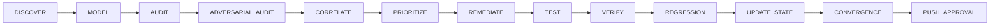

# Flowmap — 13-Phase Audit Flow

```mermaid
flowchart LR
    DISCOVER --> MODEL --> AUDIT --> ADVERSARIAL_AUDIT --> CORRELATE
    CORRELATE --> PRIORITIZE --> REMEDIATE --> TEST --> VERIFY
    VERIFY --> REGRESSION --> UPDATE_STATE --> CONVERGENCE --> PUSH_APPROVAL
```

Per-phase detail: `sequence/audit-execution.md`. Lineage invariants: `dfd/level-1.md`.
