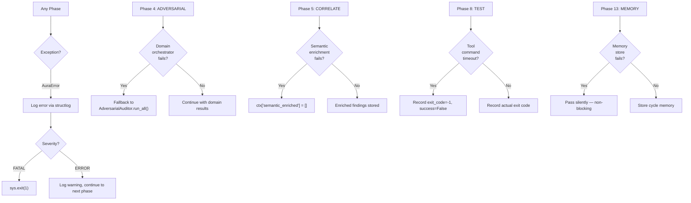

# Audit Execution Flow — AURA v3.5

> **Verified from:** `src/aura/engine.py:112-144`, `src/aura/cli.py:208-224`

## Full Audit Flow

```mermaid
flowchart TD
    START(["aura audit"]) --> LOAD_CONFIG[Load config\nfrom aura.json or env]
    LOAD_CONFIG --> INIT_ENGINE[Engine.__init__\nrepo_root, config, llm_client]
    INIT_ENGINE --> INIT_DB[Database.initialize\nWAL mode, foreign keys, migrations]
    INIT_DB --> CHECK_CYCLE{Has existing\ncycle?}
    CHECK_CYCLE -->|No| INIT_C1[_init_cycle_1\ncreate cycle 1, gates]
    CHECK_CYCLE -->|Yes| NEXT_CYCLE[increment cycle_number]
    INIT_C1 --> NEXT_CYCLE
    NEXT_CYCLE --> START_CYCLE[_start_cycle\ninsert cycle, init convergence]
    
    START_CYCLE --> P1["🔍 Phase 1: DISCOVER\n_git_context + _detect_languages"]
    P1 --> P2["🏗️ Phase 2: MODEL\n_detect_project_type"]
    P2 --> P3["📊 Phase 3: AUDIT\nMultiLangAnalyzer.analyze()"]
    P3 --> P4["🛡️ Phase 4: ADVERSARIAL_AUDIT\nDomainAuditOrchestrator.run_all_legacy()"]
    P4 --> P5["🔗 Phase 5: CORRELATE\ndedup, normalize, context filter, semantic enrich"]
    P5 --> P6["📋 Phase 6: PRIORITIZE\nsort by severity, category"]
    P6 --> P7["🔧 Phase 7: REMEDIATE\ninsert findings + ancillary into DB"]
    P7 --> P8["🧪 Phase 8: TEST\n_run_tooling: SAST + language tools"]
    P8 --> P9["✅ Phase 9: VERIFY\ntrack independent verification evidence"]
    P9 --> P10["🔄 Phase 10: REGRESSION\ncheck for reappeared findings"]
    P10 --> P11["📈 Phase 11: UPDATE_STATE\ncompute severity counts, quality"]
    P11 --> P12["🎯 Phase 12: CONVERGENCE\n12 gates, score, classification"]
    P12 --> P13["🚀 Phase 13: PUSH_APPROVAL\nstore memory, log status"]
    
    P13 --> COMPLETE[_complete_cycle\nupdate cycle, return result]
    COMPLETE --> DISPLAY["Display result\n(rich formatted or JSON)"]
    DISPLAY --> END(["Exit"])
```



## Exceptional Paths



## Startup Flow

```mermaid
flowchart TD
    ENTRY(["python -m aura"]) --> MAIN[aura.cli:main()]
    MAIN --> CLI_GROUP["click.group: cli()"]
    CLI_GROUP --> LOAD_DOTENV[load_dotenv()]
    LOAD_DOTENV --> PARSE_ARGS["Parse --config, --repo, --verbose, --json"]
    PARSE_ARGS --> LOAD_CONFIG["AuraConfig.from_env_or_file()"]
    LOAD_CONFIG --> CONFIG_OK{Config\nvalid?}
    CONFIG_OK -->|No| EXIT_CONF["red: error message\nsys.exit(1)"]
    CONFIG_OK -->|Yes| DISPATCH["Route to subcommand"]
    DISPATCH --> INIT["aura init"]
    DISPATCH --> AUDIT["aura audit"]
    DISPATCH --> STATUS["aura status"]
    DISPATCH --> HEALTH["aura health"]
    DISPATCH --> DOCTOR["aura doctor"]
    DISPATCH --> VERIFY["aura verify"]
    DISPATCH --> LOG["aura log"]
    DISPATCH --> REPORT["aura report"]
    DISPATCH --> TREND["aura trend"]
    DISPATCH --> AUTOFIX["aura auto-fix"]
```