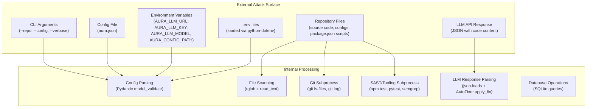

# Attack Surface Analysis — AURA v3.5

> **Verified from:** `src/aura/*.py`

## Attack Surface Map

## Attack Vectors

### AV1: Malicious Repository
**Surface:** Repository files read by AURA
**Risk:** Medium
**Path:** `engine.py → analyzer.py → rglob + read_text`
**Impact:** Regex-based scanning is read-only — no code execution from scanned files. However, `_detect_commands()` reads `package.json` to extract npm scripts and executes them via subprocess.
**Mitigation:** Test/lint commands are typically safe (read-only operations), but npm scripts can contain arbitrary code.

### AV2: LLM Response Injection
**Surface:** JSON content from LLM API parsed and potentially written to disk
**Risk:** HIGH
**Path:** `AutonomousRemediationLoop → AutoFixer.apply_fix() → file write`
**Mitigation:**
- Path traversal check (`remediation.py:103-110`)
- Dangerous pattern block list (`remediation.py:118-127`)
- Old code verification (`remediation.py:157-177`)
- Dry-run mode available
**Residual Risk:** Block list is not comprehensive — an LLM could produce novel dangerous code not matching the patterns.

### AV3: Subprocess Command Injection
**Surface:** Tooling commands passed to `subprocess.run()`
**Risk:** Medium
**Path:** `engine._run_tooling() → subprocess.run(["cmd", "/c", cmd])`
**Impact:** On Windows, `cmd /c` is a shell interpreter. Configurable `required_pass_commands` could contain shell metacharacters.
**Mitigation:** Hardcoded commands in `_detect_commands()` are trusted. User-provided commands from config pass through `cmd /c`.

### AV4: Git Command Injection
**Surface:** Git commands with repo root as cwd
**Risk:** Low
**Path:** `engine._get_git_context() → subprocess.run(["git", args])`
**Impact:** Args are hardcoded strings (`--version`, `branch --show-current`, `log --oneline -5`, `status --short`, `ls-files`), not user-controlled.
**Mitigation:** Hardcoded args list, `shell=False` (default).

### AV5: SQLite Injection
**Surface:** Dynamic SQL queries in `db.py`
**Risk:** Low
**Path:** `Database.get_findings()`, `update_cycle()`, etc.
**Impact:** SQL is constructed with parameterized queries (`?` placeholders), not string concatenation.
**Mitigation:** All queries use `?` placeholders with parameter arrays. No user-controlled strings are interpolated into SQL.

### AV6: Config Injection
**Surface:** JSON config file parsed at startup
**Risk:** Low
**Path:** `AuraConfig.from_file() → json.loads() → model_validate()`
**Impact:** Pydantic strictly validates all fields. Invalid config causes immediate exit.
**Mitigation:** Pydantic v2 with `model_validate`, type coercion disabled by default.

### AV7: Path Traversal in File Access
**Surface:** User-controlled `--repo` flag
**Risk:** Low
**Path:** `Engine.__init__() → Path(repo_root).resolve()`
**Impact:** Engine reads files within repo_root using `rglob`. No way to escape repo_root with rglob.
**Mitigation:** Path resolution + rglob traversal is bounded to the directory tree.

## Dependency Supply Chain

| Dependency | Version | Risk |
|---|---|---|
| click | >=8.0 | Standard CLI framework — low risk |
| rich | >=13.0 | Terminal formatting — low risk |
| pydantic | >=2.0 | Config validation — low risk |
| httpx | >=0.27 | HTTP client for LLM API — moderate risk (network library) |
| tenacity | >=9.0 | Retry library — low risk |
| structlog | >=24.0 | Logging — low risk |
| python-dotenv | >=1.0 | Env var loading — low risk |

All dependencies are standard, well-maintained packages with no known critical vulnerabilities at the listed versions.