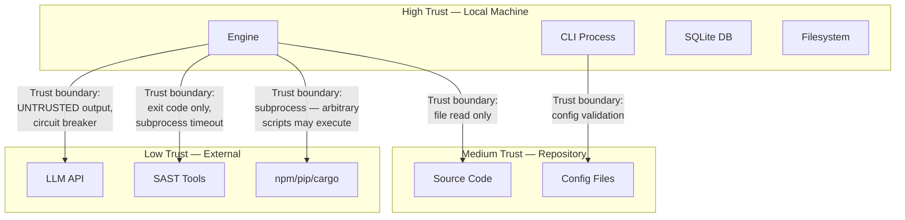

# Threat Model — AURA v3.5

> **Verified from:** full source code audit

## STRIDE Analysis

### Spoofing

| Threat | Impact | Mitigation (Current) | Status |
|---|---|---|---|
| Malicious LLM impersonating legitimate API | UNTRUSTED output accepted as findings | `LLMResponse.untrusted=True` — all LLM output is tagged untrusted. `engine.py:22-23` states "LLM output = UNTRUSTED CLAIM until validated by evidence." | PARTIAL — untrusted tag is metadata only; no cryptographic verification of API endpoint identity |
| Malicious user providing fake CLI args | N/A — CLI is local | No authentication needed for local CLI | ACCEPTABLE |
| Fake repository submissions | False audit results | None — AURA runs locally on the user's filesystem | ACCEPTABLE (trust boundary: local machine) |

### Tampering

| Threat | Impact | Mitigation | Status |
|---|---|---|---|
| Tampered SQLite database | Corrupted audit state | `PRAGMA integrity_check` via `aura health` command | PARTIAL — integrity check is CLI-optional, not automatic |
| Tampered evidence chain entries | False verification proof | `EvidenceChain.verify_chain()` — SHA-256 hash chain verification (`evidence.py:118-124`) | IMPLEMENTED |
| Tampered checkpoint file | Incorrect resume state | No integrity verification on `.aura/checkpoint.json` | MISSING — checkpoint file is plain JSON with no hash/signature |
| Modified source files during audit | Inconsistent scan results | No file locking or snapshot mechanism | MISSING — race condition between `rglob` and `read_text` |
| Tampered `LIMITATIONS.md` | False convergence | `_validate_limitations_file()` checks content quality, not authorship | PARTIAL — validates content structure but not provenance |
| LLM output injected into source code | Malicious code committed to repository | `AutoFixer` sandbox checks: path traversal prevention + dangerous pattern blocking (`remediation.py:101-127`) | IMPLEMENTED |

### Repudiation

| Threat | Impact | Mitigation | Status |
|---|---|---|---|
| Finding status changed without evidence | Unable to trace who changed what | `audit_log` table — immutable log with actor, event_type, detail. `insert_audit_log()` records every phase and state change | IMPLEMENTED |
| Convergence claimed without proof | False production readiness | `EvidenceChainBuilder.build_convergence_proof()` — cryptographic evidence chain (`convergence.py:304-321`) | IMPLEMENTED |
| Remediation applied but not recorded | Loss of fix history | `remediation_attempts` table stores every fix attempt with status, patch, error | IMPLEMENTED |

### Information Disclosure

| Threat | Impact | Mitigation | Status |
|---|---|---|---|
| API keys in stdout/stderr | Credential leakage | Secret patterns are redacted in evidence: `re.sub(r'["\'](.{4})[^"\']*(.{4})["\']', r'"\\1***\\2"', ...)` (`adversarial.py:324`) | IMPLEMENTED |
| Secret values in audit log | Credential exposure in DB | Secret detection marks "Potential hardcoded credential" but evidence contains redacted version | IMPLEMENTED |
| LLM API keys logged | Credential leakage | LLM keys read from env var (`$AURA_LLM_KEY`), never hardcoded. `cli.py:522-523` enforces this | IMPLEMENTED |
| Source code in audit output | IP leakage | Only structure/statistics reported, not file contents | IMPLEMENTED |
| Database stored in readable location | Unauthorized access | Database at `.aura/state/aura.db` — relies on filesystem permissions | PARTIAL — no DB encryption or access control |

### Denial of Service

| Threat | Impact | Mitigation | Status |
|---|---|---|---|
| Large repository exhausts memory | Engine crash | `SKIP_DIRS` excludes 30+ directories (node_modules, etc.). File size thresholds per language. Scale warnings at 500/2000/5000 files | PARTIAL — detection exists but no actual throttling or chunking |
| Infinite audit loop | Resource exhaustion | `LoopSafeguard.MAX_ITERATIONS=10`, `NO_PROGRESS_CYCLES=3` | IMPLEMENTED |
| LLM API rate limiting | Audit stalls | `OpenAICompatibleProvider` retries with exponential backoff (2^n, max 30s). `ProviderRegistry` fallback routing | IMPLEMENTED |
| Subprocess timeout | Phase hangs | `subprocess.run(timeout=300)` for tooling commands, `timeout=30` for git commands | IMPLEMENTED |

### Elevation of Privilege

| Threat | Impact | Mitigation | Status |
|---|---|---|---|
| Malicious code in repository | Code execution via subprocess | `subprocess.run()` with `shell=False` on Windows (`cmd /c`), no shell injection vector in dynamic commands | PARTIAL — tooling commands like `npm run test` execute arbitrary package.json scripts |
| Path traversal in AutoFixer | Write outside repository | `AutoFixer.apply_fix()` resolves path and checks it starts with `repo_root` (`remediation.py:103-110`) | IMPLEMENTED |
| Sandbox bypass via crafted LLM output | Dangerous code written to disk | Pattern-based blocking: `os.system(`, `subprocess.`, `exec(`, `eval(`, `__import__`, `rm -rf`, etc. (`remediation.py:118-127`) | IMPLEMENTED |
| Shell injection via tooling commands | Arbitrary command execution | Commands are `subprocess.run(["cmd", "/c", cmd])` — shell metacharacters could be interpreted | PARTIAL — commands from `_detect_commands()` are hardcoded, but `required_pass_commands` from config could be user-controlled |

## Trust Boundaries

## Attack Surface

| Surface | Entry Point | Risk | Mitigation |
|---|---|---|---|
| CLI args | `click` parameter parsing | Low | Pydantic validation |
| Config file | `aura.json` parsing | Low | Pydantic `model_validate`, fail-fast |
| Environment variables | `os.environ.get()` | Low | Only reads specific vars (AURA_LLM_*, AURA_CONFIG_PATH) |
| Repository files | `rglob`, `read_text` | Medium | Skip dirs, size thresholds, encoding error handling |
| LLM API response | `resp.json()` parsing | High | `LLMResponse.untrusted=True`, JSON parse error handling |
| LLM output as code | `AutoFixer.apply_fix()` | High | Sandbox: path traversal check + dangerous pattern block |
| Subprocess commands | `subprocess.run()` | Medium | Timeout (30s/300s), exit code capture only |
| SQLite DB | `sqlite3.connect()` | Low | Single-file, no network access |
| Checkpoint file | JSON read/write | Low | Parse error handling |