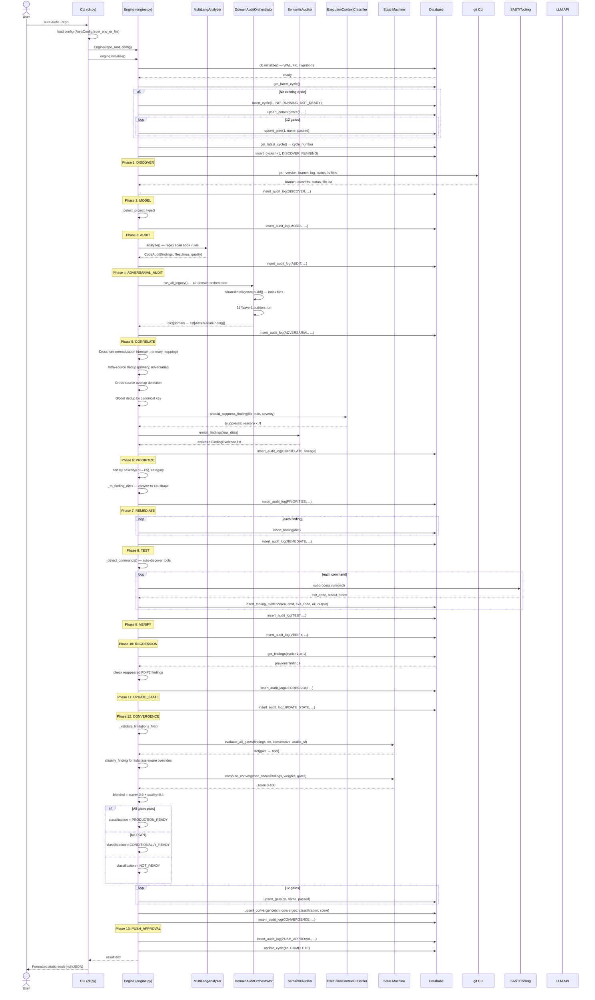

# Audit Execution Sequence — AURA v3.5

> **Verified from:** `src/aura/engine.py:50-820`, `src/aura/cli.py:208-224`

## Sequence: Single `aura audit` Cycle

## Cross-Correlation Between Diagrams

This sequence directly reflects:
- **DFD Level 1:** Same 13 phases, same data store interactions
- **State Machine:** `evaluate_all_gates` and `compute_convergence_score` from `state_machine.py`
- **Context Diagram:** git CLI, SAST tools, LLM API, DB — all shown as actors
- **Component Diagram:** Engine owns Analyzer, DomainAuditOrchestrator, Semantic, Context, DB