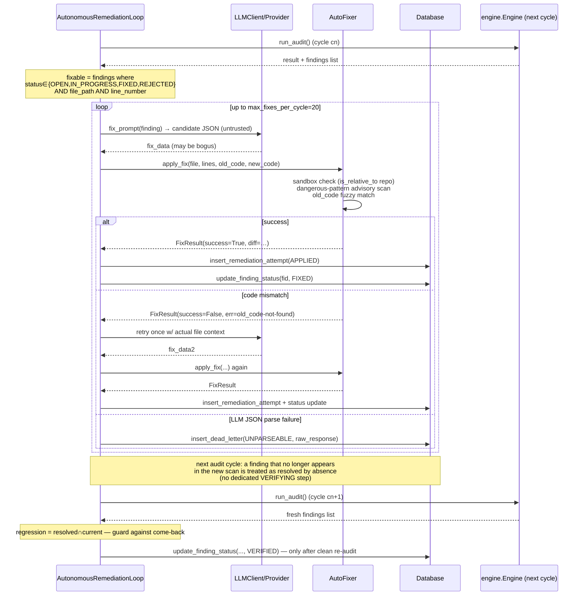

# Sequence — Finding Validation & Verification

> Sources: `evidence.py:164-236` (validators — opt-in), `remediation.py:58-588`,
> `llm.py:133-224`, `engine.py:510-530`, `db.py:340-373`.

## Intended verification model (as documented by docstrings)

A finding is VERIFIED only when ALL of these hold:
1. The orchestrator (not the LLM) ran the verification tooling.
2. Real exit codes were captured.
3. An **independent verifier** (not the remediator) confirmed the fix.
4. Regression audit confirms no re-introduction.
5. State transition passed through FIXED → VERIFYING → VERIFIED (`state_machine.py`).

## Actual runtime flow (as implemented)

## Where `EvidenceValidator` fits

`evidence.py:164-236` provides three opt-in helpers: `validate_verified_finding`,
`validate_convergence_claim`, `grade_evidence_quality`. They are **NOT invoked by
`engine.run_audit()`** (verified by grep; only callers are adversarial self-test
campaigns `adversarial.py:702-710` and tests). The runtime verification signal is:

- `tooling_evidence.exit_code == 0` recorded per cycle,
- re-audit absence of the finding (identity no longer in `current_ids`),
- `regressions ∩ current_ids == ∅`,
- explicit DB `status=VERIFIED` updates by the remediation loop only after a clean
  re-audit has no regression.

## Observability

- Every applied/rejected attempt persists in `remediation_attempts`.
- Unparseable LLM outputs persist in `dead_letter`.
- Rollback on batch failure: `AutoFixer.rollback()` restores file backup bytes then
  marks those `FixResult` entries `rolled_back=True,success=False` (`remediation.py:212-228`).
