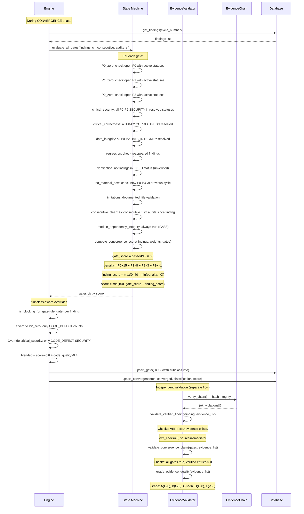
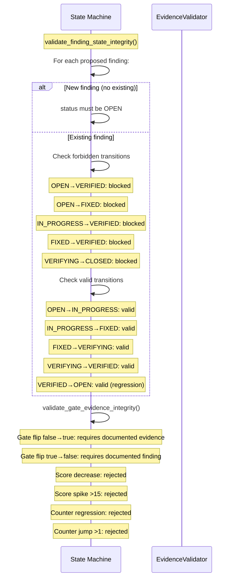

# Finding Validation Sequence — AURA v3.5

> **Verified from:** `src/aura/state_machine.py`, `src/aura/evidence.py`, `src/aura/engine.py:636-749`

## Sequence: Evidence-Based Finding Validation

## Cross-Check: Finding Transition Validity

