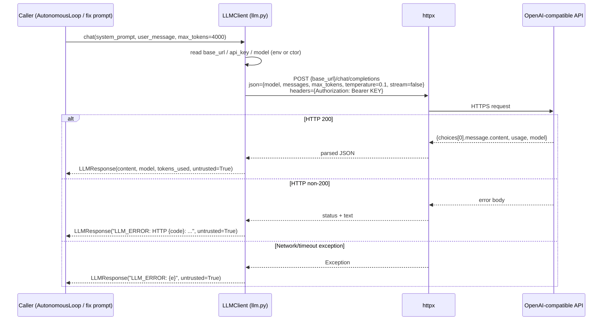

# Sequence — Provider Request

> Source: `llm.py:25-77`, `llm.py:229-256`, `providers.py:56-372`.
> See also `failure-recovery/retry.md` for retry policy and `state/provider-state.md` for health.

## Direct (single-endpoint) request — `LLMClient.chat()`



**Note:** `LLMClient` performs **zero retries, zero circuit-breaking, zero fallback** —
it is the single-shot path used by `AutonomousLoop` when the engine is created with a
bare `LLMClient`.

## Provider-backed request — `ProviderBackedLLMClient` (canonical architecture)

```mermaid
sequenceDiagram
    participant C as Caller
    participant A as ProviderBackedLLMClient
    participant R as ProviderRegistry
    participant P as OpenAICompatibleProvider
    participant CB as CircuitBreaker
    participant API as Endpoint

    C->>A: chat(system, user, max_tokens)
    A->>R: chat_with_fallback(...)
    loop up to max_providers=3, in _priority_order
        R->>P: provider.chat(...)
        P->>CB: allow_request()?
        alt circuit OPEN → early error
            CB-->>P: False → ProviderResponse(error="Circuit breaker OPEN")
        else circuit admits
            CB-->>P: True
            loop up to max_retries=3
                P->>API: POST /chat/completions
                alt 200 → success
                    API-->>P: content
                    P->>CB: record_success()
                    P-->>R: ProviderResponse(content, untrusted=True)
                    R-->>A: ProviderResponse
                    A-->>C: LLMResponse(content, untrusted=True)
                else non-retryable 4xx (400/401/403/404/422)
                    API-->>P: 4xx
                    P->>CB: record_failure()
                    P-->>R: ProviderResponse(error="HTTP 4xx (non-retryable)")
                else retryable (429/5xx/network)
                    API-->>P: error / timeout
                    P->>P: backoff = uniform(0, min(30, 2**attempt)) s<br/>or Retry-After cap
                    P->>CB: record_failure()
                    P->>API: retry
                end
            end
            P->>CB: record_failure() (final)
            P-->>R: ProviderResponse(error="Failed after N attempts: ...")
        end
        R->>R: try next non-OPEN provider
    end
    R-->>A: ProviderResponse(error="All N provider(s) failed; last error: ...")
    A-->>C: LLMResponse("LLM_ERROR: All N provider(s) failed...", untrusted=True)
```

## Trust invariant
Every LLM response — success or error — carries `untrusted=True` at every construction
site (`llm.py:22,72,74,77`, `providers.py:40,255,260,267,285,349,356`). There is no
code path in the repo that flips `untrusted` to False for an LLM response. Convergence
never reads `LLMResponse.content` to decide gates.
