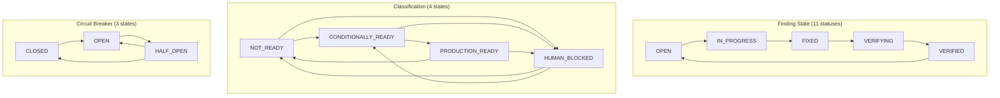

# State — README

State machine documentation for AURA.

| Document | Scope |
|---|---|
| [finding-state.md](finding-state.md) | Finding lifecycle (11 statuses, valid/invalid transitions) |
| [provider-state.md](provider-state.md) | Classification state (4 states), Circuit Breaker state (3 states), Provider Health state (4 states), Convergence Gate invariants |
| [audit-state.md](audit-state.md) | Cycle state progression |

## State Machine Overview

