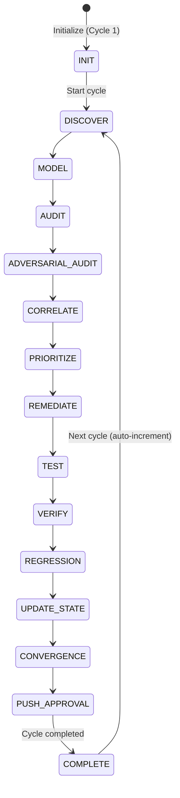
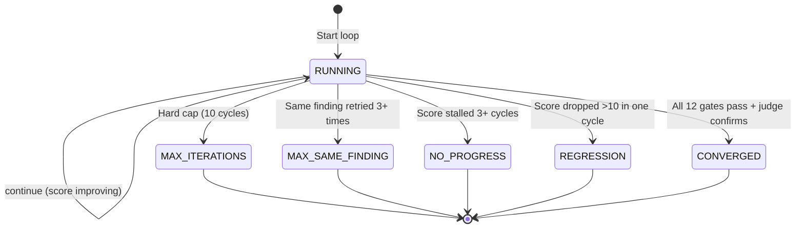

# Audit Cycle State — AURA v3.5

> **Verified from:** `src/aura/engine.py:87-144`, `src/aura/db.py`, `src/aura/convergence.py:38-161`

## Cycle State

The audit cycle progresses through 13 phases. The phase is tracked in the `cycles` table column `phase`, and the overall cycle status is tracked in `status`.

## Cycle Database State

| Field | Type | Description |
|---|---|---|
| cycle_number | INTEGER UNIQUE | Auto-incremented per audit |
| phase | TEXT | Current phase name (INIT→COMPLETE) |
| status | TEXT | RUNNING / COMPLETED |
| classification | TEXT | NOT_READY / CONDITIONALLY_READY / PRODUCTION_READY |
| overall_score | INTEGER | 0-100 convergence score |
| cycles_without_progress | INTEGER | Counter for stall detection |
| consecutive_converged_cycles | INTEGER | How many cycles since last non-converged |
| started_at | TEXT | ISO timestamp |
| completed_at | TEXT | ISO timestamp (null until COMPLETE) |

**Source:** `src/aura/db.py:34-48`

## Autonomous Loop State (Safeguard)

The `LoopSafeguard` class (`convergence.py:163-213`) manages the autonomous loop's termination state:

**Safeguard limits:**
- `MAX_ITERATIONS = 10` (hard cap on total cycles)
- `MAX_SAME_FINDING_ATTEMPTS = 3` (per-finding retry limit)
- `NO_PROGRESS_CYCLES = 3` (stall detection)
- `REGRESSION_THRESHOLD = -10` (score drop threshold)