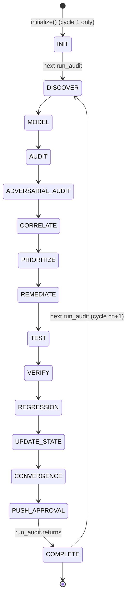
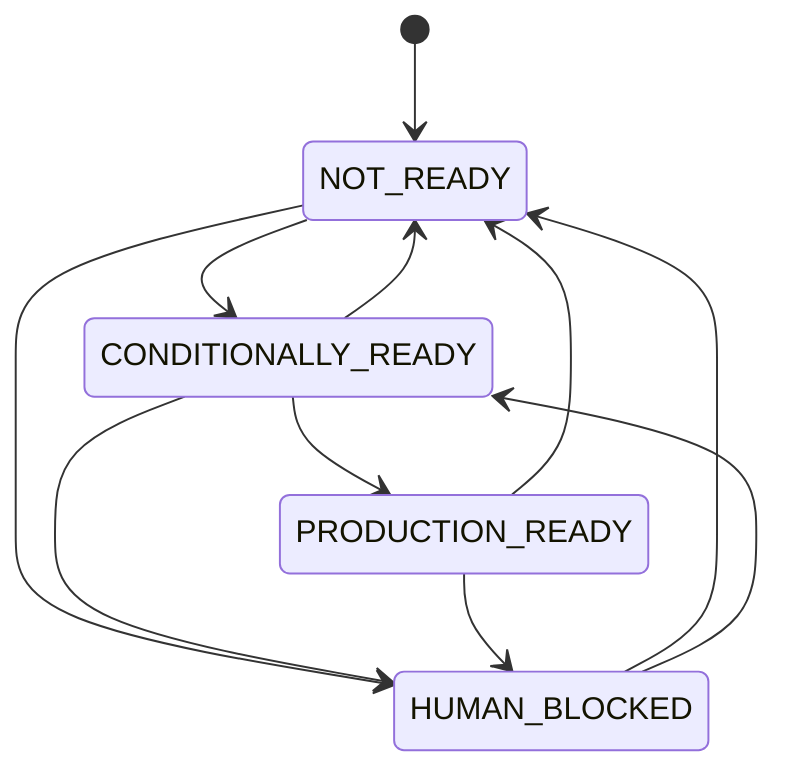

# Audit State Machine (cycle-level persistence)

> Source: `db.py:33-48` (cycles table), `engine.py:110-183` (lifecycle) + CLI status.

## Cycle state (DB columns, not enum)

A cycle row tracks (column-level): `phase ∈ {INIT, DISCOVER, MODEL, AUDIT, ADVERSARIAL_AUDIT, CORRELATE, PRIORITIZE, REMEDIATE, TEST, VERIFY, REGRESSION, UPDATE_STATE, CONVERGENCE, PUSH_APPROVAL, COMPLETE}`, `status ∈ {RUNNING, COMPLETE}` (plus ad-hoc), and `classification ∈ {NOT_READY, CONDITIONALLY_READY, PRODUCTION_READY, HUMAN_BLOCKED}`.

## Phase progression (per `run_audit`)

There is no error state: a phase raising an exception aborts the cycle with the cycle row
left in whatever phase it last recorded (status remains RUNNING) — recovery is to re-run
`run_audit()`, which inserts row cn+1 anyway (best-effort forward).

## Classification state transitions

(duplicates state/finding-state.md at the cycle level; shown here for completeness)

Direct `NOT_READY → PRODUCTION_READY` is **not in the whitelist**
(`state_machine.VALID_CLASSIFICATION_TRANSITIONS:31-36`). Engines that go from a
blocking state to converged in one cycle necessarily pass through CONDITIONALLY_READY
in the same cycle's computation (engine.py:764-772 computes the final class directly
from gate state — the whitelist is enforced only when pairs of (old_class, new_class)
round-trip through the state machine validators).

## Consecutive counter logic (audited)

From `engine.py:781`: `consecutive_converged_cycles = prev + (1 if converged OR classification == CONDITIONALLY_READY else 0)`.
Conditioned counter **also increments on CONDITIONALLY_READY**, not just on PRODUCTION_READY —
this is deliberate (CHANGELOG: "CONDITIONALLY_READY counter — increments for CONDITIONALLY_READY").

`audits_since_last_finding = prev + 1` unconditionally (cycle completed without new P0-P3s
drives `no_material_new_findings`).
