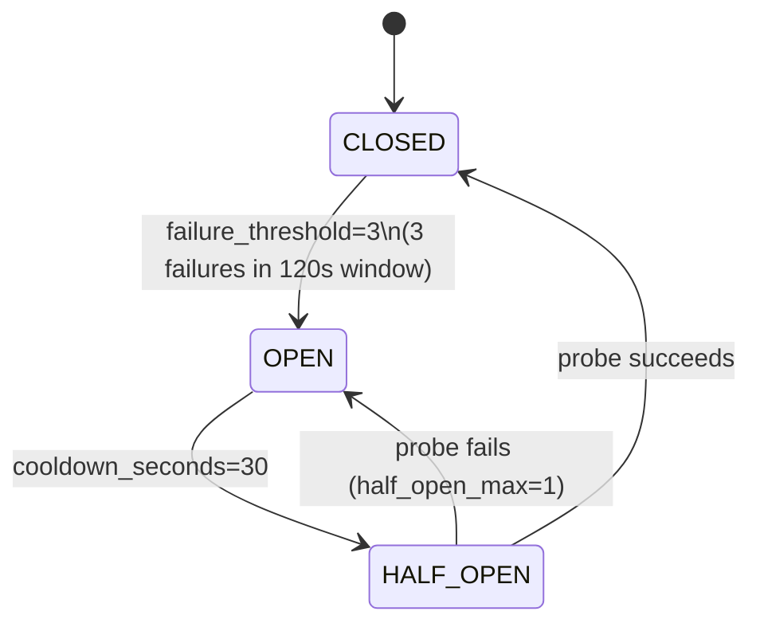

# Circuit Breaker State — AURA v3.5

> **Verified from:** `src/aura/providers.py:56-118`

This is documented in detail in [provider-state.md](provider-state.md) (under "Circuit Breaker State Machine") and in [failure-recovery/circuit-breaker.md](../failure-recovery/circuit-breaker.md).

## States



## Transition Conditions

| Transition | Condition | Source |
|---|---|---|
| CLOSED → OPEN | `len(failure_timestamps) >= failure_threshold (3)` within `rolling_window_seconds (120s)` | `providers.py:101-102` |
| OPEN → HALF_OPEN | `time.now() - last_failure_time >= cooldown_seconds (30s)` | `providers.py:108-111` |
| HALF_OPEN → CLOSED | Probe request succeeds → `record_success()` | `providers.py:80-82` |
| HALF_OPEN → OPEN | `half_open_attempts >= half_open_max (1)` | `providers.py:97-100` |
| CLOSED → CLOSED | Each success prunes stale failure timestamps from rolling window | `providers.py:83-86` |

## Available Interfaces

```python
cb = CircuitBreaker()
cb.allow_request()   # → bool: should we allow this call?
cb.record_success()  # → None: reset half_open counter, prune old failures
cb.record_failure()  # → None: add timestamp, check thresholds
cb.reset()           # → None: reset to CLOSED
cb.state             # → CircuitState enum
```

## Rolling Window Behavior

The rolling window (120s) means:
- If failures are spaced >120s apart, the breaker NEVER trips
- If 3 failures happen within 120s, it trips immediately
- After 120s of no failures, the window is empty (all timestamps pruned)
- This prevents a slow trickle of failures from tripping the breaker