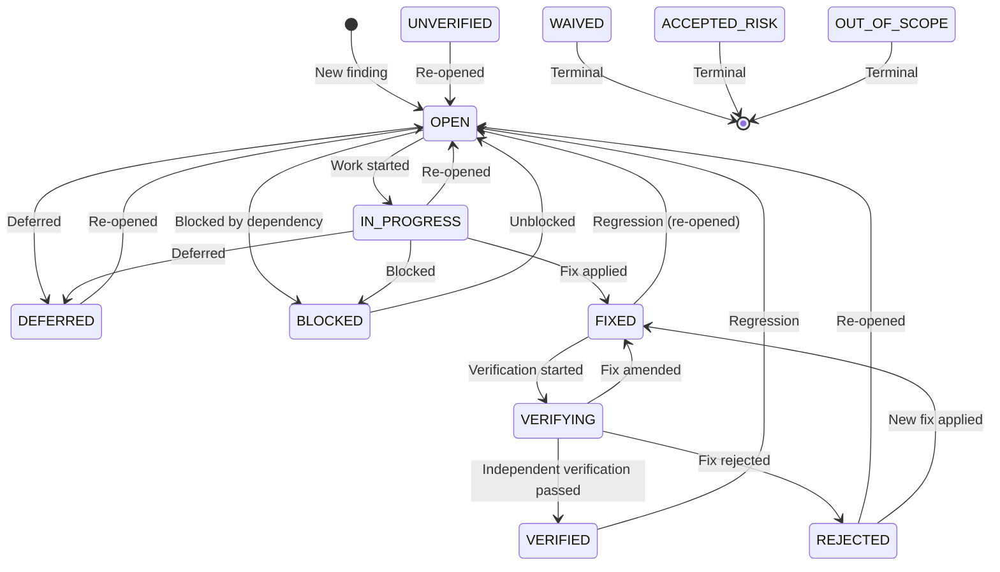

# Finding State Machine — AURA v3.5

> **Verified from:** `src/aura/state_machine.py:14-27`

## States



## Transitions Table

| From | To | Allowed? | Notes |
|---|---|---|---|
| OPEN | IN_PROGRESS | ✅ | |
| OPEN | DEFERRED | ✅ | |
| OPEN | BLOCKED | ✅ | |
| OPEN | VERIFIED | ❌ | Must pass through FIXED → VERIFYING |
| OPEN | FIXED | ❌ | Must pass through IN_PROGRESS |
| IN_PROGRESS | FIXED | ✅ | |
| IN_PROGRESS | DEFERRED | ✅ | |
| IN_PROGRESS | BLOCKED | ✅ | |
| IN_PROGRESS | OPEN | ✅ | |
| IN_PROGRESS | VERIFIED | ❌ | Must pass through FIXED → VERIFYING |
| FIXED | VERIFYING | ✅ | |
| FIXED | OPEN | ✅ | Regression |
| FIXED | VERIFIED | ❌ | Must pass through VERIFYING |
| VERIFYING | VERIFIED | ✅ | |
| VERIFYING | REJECTED | ✅ | |
| VERIFYING | FIXED | ✅ | Fix amended |
| VERIFYING | CLOSED | ❌ | CLOSED is not a valid status |
| VERIFIED | OPEN | ✅ | Detection of regression |
| REJECTED | OPEN | ✅ | |
| REJECTED | FIXED | ✅ | |
| DEFERRED | OPEN | ✅ | |
| BLOCKED | OPEN | ✅ | |
| UNVERIFIED | OPEN | ✅ | |
| WAIVED | (any) | ❌ | Terminal |
| ACCEPTED_RISK | (any) | ❌ | Terminal |
| OUT_OF_SCOPE | (any) | ❌ | Terminal |

## Implementation

```python
VALID_FINDING_TRANSITIONS: dict[str, list[str]] = {
    "OPEN":        ["IN_PROGRESS", "DEFERRED", "BLOCKED"],
    "IN_PROGRESS": ["FIXED", "DEFERRED", "BLOCKED", "OPEN"],
    "FIXED":       ["VERIFYING", "OPEN"],
    "VERIFYING":   ["VERIFIED", "REJECTED", "FIXED"],
    "VERIFIED":    ["OPEN"],
    "REJECTED":    ["OPEN", "FIXED"],
    "DEFERRED":    ["OPEN"],
    "BLOCKED":     ["OPEN"],
    "UNVERIFIED":  ["OPEN"],
    "WAIVED":      [],  # Terminal
    "ACCEPTED_RISK": [], # Terminal
    "OUT_OF_SCOPE": [],  # Terminal
}
```

**Source:** `src/aura/state_machine.py:14-27`

## Finding Lifecycle

```mermaid
graph LR
    A[Pattern match] --> B[RAW regex match]
    B --> C[LOCATED — AST confirmed]
    C --> D[ANALYZED — data-flow/taint analyzed]
    D --> E[CLASSIFIED — confidence assigned]
    E --> F[ACTIONABLE — ready for remediation]
    F --> G[FIXED — patch applied]
    G --> H[VERIFIED — independent verification]
    H --> I[REGISTERED — in convergence DB]
```



Note: The FindingStatus enum (`semantic.py:34-44`) defines RAW→LOCATED→ANALYZED→CLASSIFIED→ACTIONABLE→FIXED→VERIFIED→MITIGATED→WAIVED, but these are NOT enforced by the state machine — only the 11 statuses in `VALID_FINDING_TRANSITIONS` are enforced.