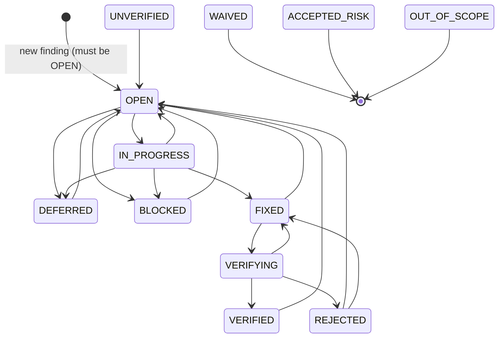
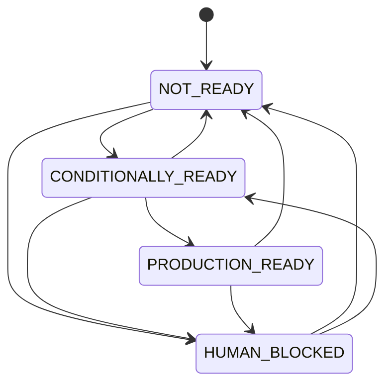

# Finding State Machine

> Authoritative source: `src/aura/state_machine.py:14-46` + DB CHECK constraint
> `db.py:55-60`. 12 statuses; whitelisted transitions; forbidden direct jumps.

## Statuses (DB-enforced)

`OPEN, IN_PROGRESS, FIXED, VERIFYING, VERIFIED, REJECTED, DEFERRED, BLOCKED, UNVERIFIED, WAIVED, ACCEPTED_RISK, OUT_OF_SCOPE`

Terminal statuses (no outgoing transitions): **WAIVED, ACCEPTED_RISK, OUT_OF_SCOPE**
(`VALID_FINDING_TRANSITIONS[X] == []`). `CLOSED` exists only inside a forbidden-transition
rule (`VERIFYING→CLOSED` blocked), not as a real column value.

## Transition graph

## Forbidden direct transitions (blocked with reason)

| From | To | Reason |
|---|---|---|
| OPEN | VERIFIED | Must pass through FIXED and VERIFYING |
| OPEN | FIXED | Must pass through IN_PROGRESS |
| IN_PROGRESS | VERIFIED | Must pass through FIXED and VERIFYING |
| FIXED | VERIFIED | Must pass through VERIFYING |
| VERIFYING | CLOSED | Must pass through VERIFIED or REJECTED |

(`state_machine.FORBIDDEN_DIRECT_TRANSITIONS` L40-46; mirrored in `config/aura.json`
`state_machine.forbidden_direct_transitions`.)

## Invariants enforced by validators

1. New findings **must enter as OPEN** — any other status is a `NEW FINDING VIOLATION`
   (`validate_finding_state_integrity` L146-152).
2. Every transition must be in the whitelist AND not in the forbidden list;
   violators are returned as strings, never silently coerced (L154-173).
3. Statuses are also constrained at the DB layer (`CHECK(status IN (...))` `db.py:57-60`),
   so a bad status fails on INSERT/UPDATE even if the validator is bypassed.
4. `finding_id` identity accessor `_finding_key` accepts both `id` and `finding_id`
   (R2-01) so drift between DB rows (`finding_id`) and validator/test payloads (`id`)
   cannot silently empty the identity set.

## Classification state machine (cycle-level)

(`state_machine.VALID_CLASSIFICATION_TRANSITIONS` L31-36; `is_valid_classification_transition` L180-189.)

## Measured classification truth-table (real gate evaluation, 2026-08-22)

`compute` = `evaluate_all_gates` (+ **engine subclass override** for
`P2_zero`/`critical_security`: only `CODE_DEFECT` findings count,
`engine.py:738-754`) + `compute_convergence_score` + engine classification rule
(`engine.py:764-772`): **PRODUCTION_READY iff all 12 gates pass;
CONDITIONALLY_READY iff open CODE_DEFECT P0==0 AND P1==0;
NOT_READY otherwise.** (Note: NOT_READY is driven by P0/P1 only —
open P2 findings do NOT by themselves force NOT_READY; confirmed by probe.)

| Input state | gates passed | score | classification |
|---|---|---|---|
| no findings, limitations ok, cons=2, audits=2 | 12 | 100 | PRODUCTION_READY |
| no findings, limitations ok, cons=0 | 11 | 95 | CONDITIONALLY_READY |
| no findings, NO LIMITATIONS.md, cons=2 | 11 | 95 | CONDITIONALLY_READY |
| 1× P0 OPEN (SECURITY) | 10 | 75 | NOT_READY |
| 1× P2 OPEN (CORRECTNESS) | 10 | 87* | CONDITIONALLY_READY* |
| **1× P3 OPEN (MAINTAINABILITY)** | 12 | **99** | **PRODUCTION_READY** |
| 5× P3 OPEN | 12 | 95 | PRODUCTION_READY |

*`1xP2_open` row was computed in a first probe that used the stricter
"no P0-P2 OPEN/IN_PROGRESS" classification rule; running the actual engine rule
(`engine.py:764-772`) classifies a lone P2 open finding CONDITIONALLY_READY, not
NOT_READY, because NOT_READY requires open CODE_DEFECT **P0 or P1** only. Both
rows are shown to document the truth-table evolution; the current rule is the
one listed above.

Reality captured as-is: P3-P5 findings never block convergence by gate count alone;
their only effect is score penalty (each P3 ≈ 1 point within the 40-point finding budget).
This is a documented *behavior*, not an endorsement — see `docs/decision-validation/convergence.md`.
