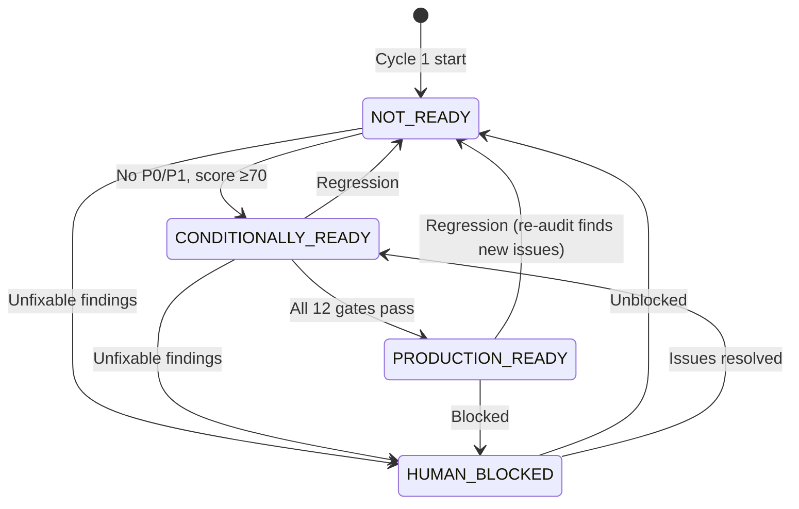
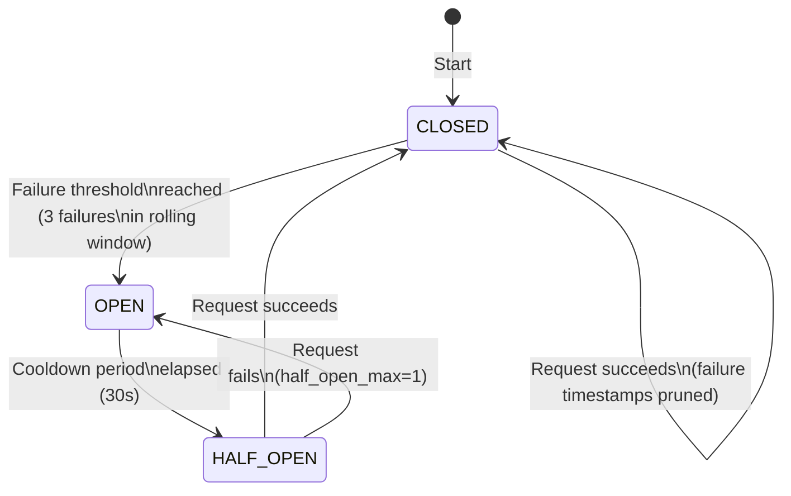
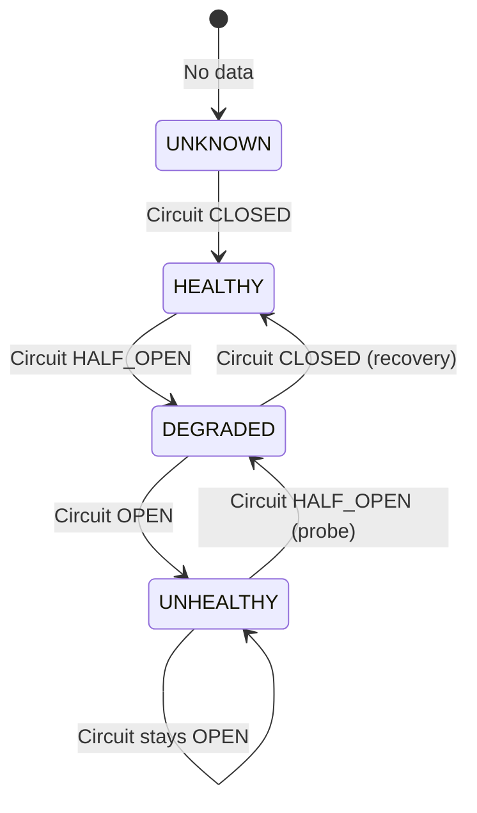
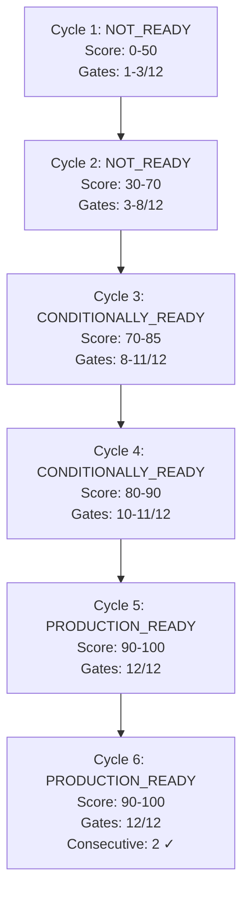

# Classification & Circuit Breaker State Machines — AURA v3.5

> **Verified from:** `src/aura/state_machine.py:30-36`, `src/aura/providers.py:26-29,56-118`

## Classification State Machine



### Valid Transitions

```python
VALID_CLASSIFICATION_TRANSITIONS: dict[str, list[str]] = {
    "NOT_READY":           ["CONDITIONALLY_READY", "HUMAN_BLOCKED"],
    "CONDITIONALLY_READY": ["PRODUCTION_READY", "NOT_READY", "HUMAN_BLOCKED"],
    "PRODUCTION_READY":    ["NOT_READY", "HUMAN_BLOCKED"],
    "HUMAN_BLOCKED":       ["NOT_READY", "CONDITIONALLY_READY"],
}
```

**Key rule:** `NOT_READY → PRODUCTION_READY` is a forbidden direct jump. Must go through `CONDITIONALLY_READY`.

**Source:** `src/aura/state_machine.py:31-36`

## Circuit Breaker State Machine



### Implementation

```python
class CircuitBreaker:
    """
    Stateful circuit breaker for provider calls.
    
    Config:
        failure_threshold=3     → trip to OPEN after 3 failures (in rolling window)
        cooldown_seconds=30.0   → wait 30s before HALF_OPEN
        half_open_max=1         → 1 probe request allowed in HALF_OPEN
        rolling_window_seconds=120.0  → window for counting failures
    """
```

**States:**
- **CLOSED:** All requests allowed through. Failures accumulated in rolling window.
- **OPEN:** All requests rejected immediately. Timer ticks down cooldown.
- **HALF_OPEN:** Single probe request allowed. Success → CLOSED, Failure → OPEN.

**Source:** `src/aura/providers.py:26-29,56-118`

## Provider Health State



```python
class ProviderHealth(str, Enum):
    HEALTHY = "healthy"       # Circuit CLOSED
    DEGRADED = "degraded"     # Circuit HALF_OPEN
    UNHEALTHY = "unhealthy"   # Circuit OPEN
    UNKNOWN = "unknown"        # No status data
```

**Source:** `src/aura/providers.py:19-23,133-149`

## Convergence Gate State

Each of the 12 gates is independently `true` or `false` per cycle. The combined state is persisted in the `gates` table with one row per (cycle_number, gate_name).

**Invariants enforced by `validate_gate_evidence_integrity()`** (`state_machine.py:183-274`):

| Invariant | Check |
|---|---|
| Gate flip false→true | Must have documented evidence |
| Gate regression true→false | Must have documented finding |
| Convergence false→true | ALL 12 gates must pass |
| Score regression | Score must stay same or increase |
| Score spike | Max +15 per cycle |
| Counter regression | consecutive_converged_cycles must not decrease |
| Counter jump | Max +1 per cycle |

### Convergence State Progression



Requirement for convergence: `consecutive_converged_cycles >= 2 AND audits_since_last_finding >= 2`