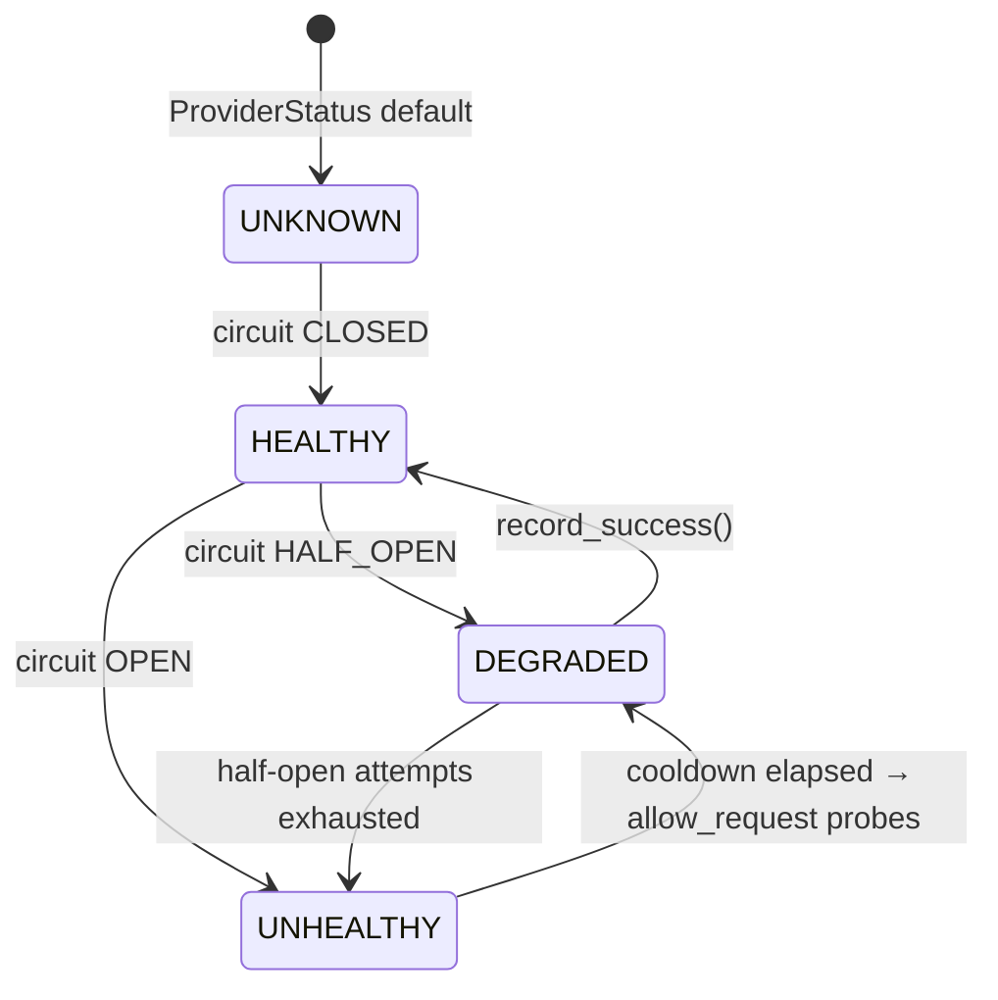

# Provider State Model

> Source: `src/aura/providers.py:19-372`.

## Health states



Health is *derived*, never set directly: `BaseProvider.status` maps
`CircuitState.OPEN→UNHEALTHY`, `HALF_OPEN→DEGRADED`, else `HEALTHY` (`providers.py:134-149`).

## Circuit breaker states

See `failure-recovery/circuit-breaker.md` for the full diagram. Three states:
`CLOSED → OPEN → HALF_OPEN → CLOSED` (or back to OPEN). Defaults:
failure_threshold=3, cooldown=30s, half_open_max=1, rolling_window=120s
(`providers.py:59-64`).

## Provider registry routing

`_priority_order` determines who is tried first. `chat_with_fallback`:

1. skip providers whose circuit is OPEN,
2. call provider.chat (its own internal retries run there),
3. on error response → move to next non-OPEN provider (up to `max_providers=3`),
4. if all fail: return single `ProviderResponse(error="All N provider(s) failed; last error: ...")`.

No retry is added *on top of* a provider call here — the retry policy lives strictly
inside `OpenAICompatibleProvider` (providers.py:179-184, 316-360; R2-04).

## ProviderResponse (typed, always `untrusted=True`)

```python
ProviderResponse(content: str, model: str="", tokens_used: int=0,
                 provider_name: str="", latency_ms: int=0,
                 untrusted: bool=True, error: str | None = None)
```

`providers.py:32-41`. The `untrusted` flag is hard-coded `True` at every construction
site in the module — there is no code path that flips a response to trusted.
